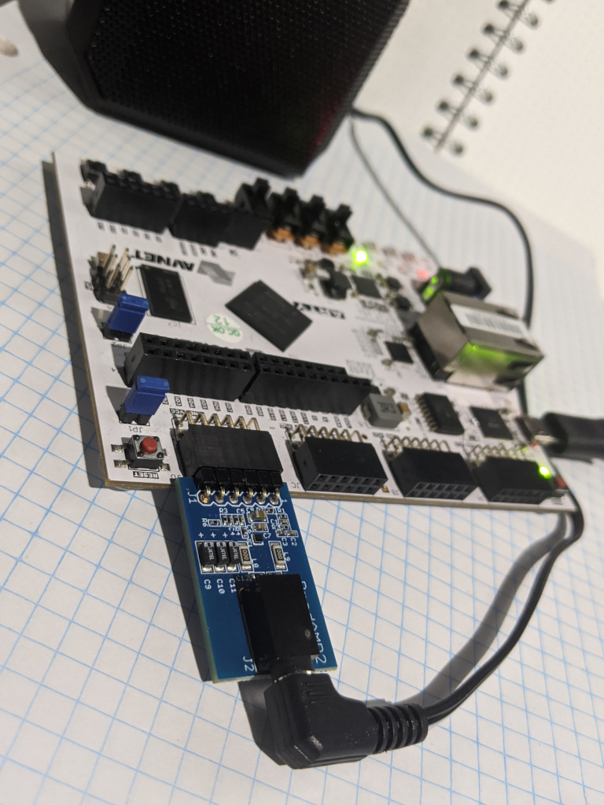
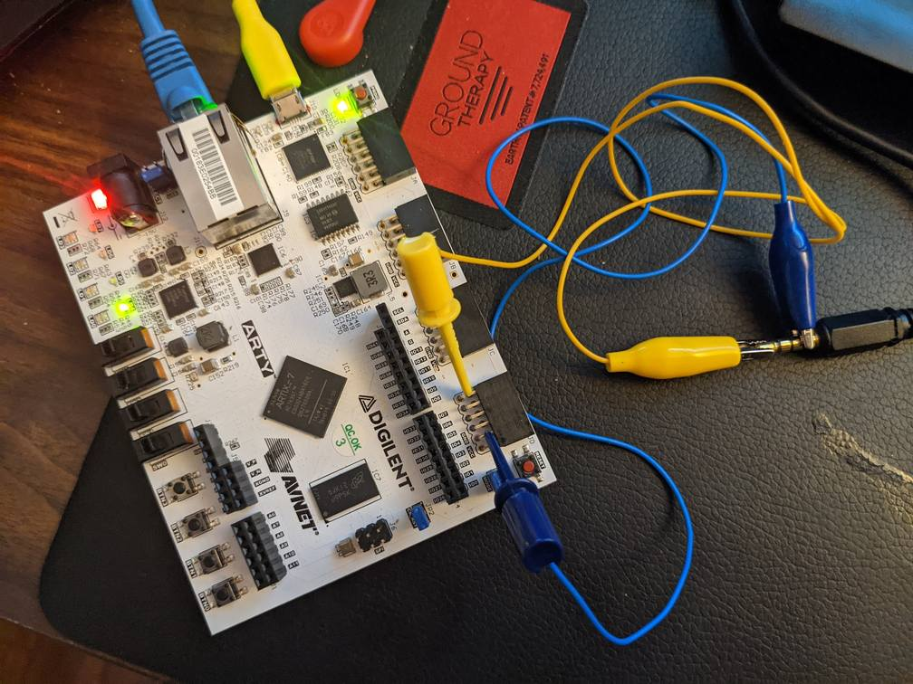

==========================================================
Building FPGA Gateware with Verilog and nMigen: A Tutorial
==========================================================

This page takes the reader through a hands-on tutorial on FPGA, Verilog and
nMigen_.

.. _nMigen: https://github.com/nmigen/nmigen

Field Programmable Gate Arrays are fascinating devices that can efficiently
perform all kinds of computing tasks. A configuration for and FPGA is known as
'gateware'.

There are a variety of ways to configure FPGAs. Verilog is perhaps the most
well known and best supported. Learning Verilog is good way to begin to
understand how FPGAs work.

It is possible to write CFUs in Verilog, but for more sophisticated CFUs we use
nMigen to generate Verilog.

------------
Getting Help
------------

Try not to get stuck for long periods of time. Generally, you'll learn more
quickly by getting help from someone who has done it before rather than
struggling yourself for long periods of time. See: :doc:`getting-help`.

----------------
Before You Begin
----------------

Obtain Equipment
================

Obtain the following:

1. An Arty A7-35T (as per the :doc:`../setup-guide`).

2. A PMOD AMP2. PMOD is a connector standard for FPGA dev boards. PMOD AMP2 is
   a simple audio output board. (Digikey_ , `Element 14`_)

.. _Digikey: https://www.digikey.com.au/products/en/development-boards-kits-programmers/evaluation-boards-expansion-boards-daughter-cards/797?k=PMODAMP2&pkeyword=&sv=0&sf=0&FV=-8%7C797&quantity=&ColumnSort=0&page=1&pageSize=25
.. _`Element 14`: https://au.element14.com/digilent/410-233/modlue-pmod-audio-amp-2-5w-class/dp/2311269?ost=pmod+amp2

3. Speaker with 3.5mm plug. Obtain this from eBay or any electronics store.

4. Optional: UPduino. A small FGPA dev board which will make the nMigen
   tutorial a little easier and faster. (Order from tindie.)
   * The UPduino often goes out of stock and sometimes delivery times are long.
   * It's more than possible to run the tutorial from an Arty A7.

.. _`Order from Tindie`: https://www.tindie.com/products/tinyvision_ai/upduino-v30-low-cost-lattice-ice40-fpga-board/

5. Micro-USB cable. You probably already have one.

Set Up
======

Follow the instructions at :doc:`../setup-guide` to set up Vivado and the CFU Playground.

----------------------------------------------
Part 1: Verilog Programming With Xilinx Vivado
----------------------------------------------

Verilog
    ... is a hardware description language (HDL) used to model electronic
    systems. It is most commonly used in the design and verification of digital
    circuits at the register-transfer level of abstraction.

    -- Wikipedia: `Verilog <https://en.wikipedia.org/wiki/Verilog>`_

Vivado Design Suite
    is a software suite produced by Xilinx for synthesis and analysis of HDL
    designs Vivado Design Suite took 1000 person-years and cost US$200
    million.

    -- Wikipedia: `Xilinx Vivado <https://en.wikipedia.org/wiki/Xilinx_Vivado>`_

Getting Familiar with The Arty A7
=================================

Work though tcal-x's Arty tutorials at `github.com/tcal-x/misc
<https://github.com/tcal-x/misc>`. To do tutorial 2 you will either need to git
clone the repo or download the top.bit file

Board Definition file
=====================

The board definition file tells Vivado about the eval board you're using -
which LEDs and switches are connected and to which pins of the FPGA.

1. Download master.zip_ to your Downloads directory.

.. _master.zip: https://github.com/Digilent/vivado-boards/archive/master.zip?_ga=2.236032133.563501946.1602061710-858136677.1600823904

2. Now, unzip the file and copy do your Xilinx directory

.. code-block:: bash

   $ cd ~/Downloads
   $ unzip master.zip
   $ cd ~/Downloads/vivado-boards-master/new
   $ cp -r board_files/ ~/tools/Xilinx/Vivado/2020.1/data/boards/

Your First Verilog Program
==========================

Start Vivado from the Linux Application menu, then follow along with this
YouTube video from Graham Chow: `Verilog using Vivado on Digilent Arty Xilinx
FPGA.`__

.. __: https://www.youtube.com/watch?v=RAUm9mR4-W4

This video is for a slightly older version of Arty and Vivado, so watch out for
changed menu item names and so forth.

* For board, choose Arty A7-35T
* Make a subdirectory for all your vivado projects. For example, if you were to
  choose ``~/vivado``, then this project's files would be stored in
  ``~/vivado/project_1``.
* XDC files:

  * XDC files are linked from the `Arty A7 Reference`_ page
  * Download Arty-A7-35-Master.xdc_ into your project's folder.
  * From the "Add Sources" dialog, make sure you choose "Add or create constraints"

* Graham says "top's always pretty popular". Verilog designs are hierarchical,
  so the name "top" is often used for the top of the hierarchy.
* At the programming step, you'll find the generated bitstream in the "runs"
  directory. For example, on ``avg``'s machine, the file was at:
  ``/home/avg/vivado/project_1/project_1.runs/impl_1/top.bit``

.. _`Arty A7 Reference`: https://reference.digilentinc.com/reference/programmable-logic/arty-a7/start
.. _Arty-A7-35-Master.xdc: https://raw.githubusercontent.com/Digilent/digilent-xdc/master/Arty-A7-35-Master.xdc

Here is the code Graham uses:

.. code-block:: verilog

    module top(
        input CLK100MHZ,
        output reg [3:0] led,
        input [3:0] sw
        );

        always @ (posedge CLK100MHZ)
        begin
            if (sw[0] == 0)
            begin
                led <= 4'b0000;
            end
            else
            begin
                led <= 4'b1111;
            end
        end
    endmodule

This downloadable guide from Xilinx contains more information about using
Vivado: `UG892 - Vivado Design Suite User Guide: Design Flows Overview`__.

.. __: https://www.xilinx.com/support/documentation/sw_manuals/xilinx2020_1/ug892-vivado-design-flows-overview.pdf

FPGA4Fun - Introductory material
================================

fpga4fun.com is full of well researched material relevant to FPGA beginners,
presented in a - well, fun - manner. It is (by far) the best online
introduction to FPGAs we have found.

Start off by reading through the material under FPGA introduction in the left
hand menu (scroll way down). The most relevant pages are:

* `What are FPGAs? <https://www.fpga4fun.com/FPGAinfo1.html>`
* `How FPGAs work <https://www.fpga4fun.com/FPGAinfo2.html>`
* `Internal RAM <https://www.fpga4fun.com/FPGAinfo3.html>`
* `FPGA pins <https://www.fpga4fun.com/FPGAinfo4.html>`
* `Clocks and global lines <https://www.fpga4fun.com/FPGAinfo5.html>`

FPGA4Fun - Music Box
====================

The `Music box tutorials`__ will teach you the basics of Verilog and how FPGAs
do computation. Instead of putting things together on a breadboard, we'll use a
PMOD AMP2 and a plug-in speaker.

.. __: https://www.fpga4fun.com/MusicBox.html

1. With your Arty board unpowered, plug the PMOD AMP2 into the top row of header JD, and plug a speaker into the PMOD.

   
If you do not have a pmod2 (maybe you have a pmod3 in your kit, and it's entirely incompatible),
you can still get basic analog output by wiring speakers between GND an JD pin#1 (jd[0] in the code)

2. Read through the first section of `Music box 1 - Simple beep`__.

.. __: https://www.fpga4fun.com/MusicBox1.html

3. Now start a new project in pretty much the same you did before while following along to the Youtube video:

   a. Start a new project in your $HOME/vivado directory
   b. Copy in the .xdc file
   c. In the XDC file, uncomment

      * CLK100MHz lines Clock lines
      * The switches - sw[0] to sw[3]
      * The leds - led[0] to led[3]
      * Under PMOD header JD, uncomment jd[0] to jd[3]

4. Use this Verilog:

.. code-block:: verilog

  module top(
      // ***(A)***
      input CLK100MHZ,
      output [3:0] jd,
      output [3:0] led,
      input [3:0] sw
      );

  // ***(B)***
  // first create an 18bit binary counter
  reg [17:0] counter;
  always @(posedge CLK100MHZ) counter <= counter+1;

  // and use the most significant bit (MSB) of the counter to drive the speaker
  wire speaker_out = counter[17];

  // ***(C)***
  // EITHER
  // (1) you wish to annoy your neighbors, so send through the full speaker volume,
  //assign jd[0] = speaker_out
  // OR
  // (2) just send through the 1/64th of the signal by only sending signal when last 6 bits of counter are zero
  assign jd[0] = speaker_out & (counter[5:0] == 0);

  // ***(D)***
  // Set switch 3 to toggle shutdown pin, turning amplifier on and off.
  // If you have housemates/family at home, you almost certainly need this
  assign jd[3] = sw[3];

  // ***(E)***
  // LEDs to help with debugging
  assign led[0] = speaker_out;   // Current wave form
  assign led[1] = jd[0];         // Attenuated signal sent to PMOD AMP
  assign led[3] = sw[3];

  endmodule

5. Note the differences between the above and the (much shorter) Verilog code on the FPGA4Fun site.

   a. Note that this Verilog puts the variable types inside the module
      statement, but fpga4fun has them outside. Both work, but the way shown here
      is more modern.
   b. We use an 18bit counter instead of a 16bit counter because we have a
      100MHz clock rather than 25 MHz clock. If that doesn't make sense, please
      ask.
   c. If we just toggle the PMOD output pin so that it's 50% on and 50% off ,
      the result is really quite loud. Instead, we "&" the speaker_out wire with
      an expression so that speaker_out == 1 causes the speaker to be on only
      1/64th of the time.
   d. jd[0] corresponds to pin 1 on pmod connector JD.
   e. jd[3] needs to be set high to enable output - check the PMODAMP2
      schematic, the SSM2377 datasheet and the PMODAMP2 packaging (below).
      We wire jd[3] to switch 3.
   f. To help with debugging, we plumb through some signals to the LEDs.

6. Synthesize and implement the design, then program it.
7. Toggle switch 3 to turn the sound on and off.

Make sure you understand what is going on here, then proceed through the rest of the sound box tutorials.

Things to do:

* Understand each example before moving onto the next.
* Poke around in the GUI. Definitely "Open Implemented Design" at least once
  and try to figure out what you're looking at.
* See if you can figure out how to run Synthesis, Implementation and Bitstream
  generation with a single click. If you can't, ask! Having to click three
  things that each take ~1minute to complete is painful.
* Have fun.
* Ask questions.

More on FPGAs
=============

Now that you've mastered the Music Box tutorials. A few important points to recap.

LUTs and FFs
  The basic elements of an FPGA are Lookup Tables (LUTs), Flip Flops (FFs) and routing to move signals between LUTs and FFs.

LUTs are not clocked.
Any signal applied to their input affects their output in a fairly short amount
of time - measured in nanoseconds. They hold no state. Their outputs are only
dependent on their inputs. LUTs can be chained together to produce complicated
functions. However if there are many LUTs or there is a long route between LUTs
in the chain, then calculating the result can take a long time.

FFs are clocked
  ... meaning they can only change their values on clock
  transitions. In Verilog, the clock transitions are specified like this:

.. code-block:: verilog

  always @(posedge clock) <statement>

This code means that the assignments in <statement> take place on every positive
edge of  the <clock> signal. After the positive edge, then the value of the
FF has changed and can affect other FFs on the next positive edge.

Everything happens all the time, unless you say not to.
  The way to enable logic sometimes and not others is to use an if statement:

.. code-block:: verilog

   always @(posedge clk)
       if(counter==0) counter <= clkdivider-1;

Verilog's syntax is C-like, but it's not C.
  Expressions work mostly like C. However, the way state is treated is very
  different from a regular procedural language. There's no need for loops, for
  instance.

Counters are an important building block.
  They are used to manage state. It is common to derive control signals from
  counters. A common pattern to do something periodically is:

.. code-block:: verilog

   always @(posedge CLK100MHZ)
   begin
     if(counter==0)
       counter <= reset_value;
       << do something >>
     else
       counter <= counter-1;
   end

---------------------
Part 2: nMigen Basics
---------------------

We're now going to dive into nMigen_, a Python based domain-specific language
for writing gateware. At the lowest levels, it works much the same as
Verilog. At the higher levels, it allows all the power of Python to be applied
to generalizing, reusing and testing components.

Preparation
===========

1. Ensure that you have git and virtualenv installed:

.. code-block: bash

   $ sudo apt install git
   $ sudo apt install python3-virtualenv

2. Install the Fomu Toolchain

   If using UPduino, you will need to install an iCE40 toolchain. We use the Fomu
   toolchain. Download the latest release of the `Fomu Toolchain`_ and extract it
   somewhere. (I just put mine directly under $HOME).

.. _`Fomu Toolchain`: https://github.com/im-tomu/fomu-toolchain

3. Create the virtualenv:

.. code-block: bash

   $ cd $HOME
   $ virtualenv -p python3 nmigen-tutorial

4. Add an alias to your ``.bashrc`` or ``.bash_aliases`` file:

.. code-block: bash

   pathadd() {
       if [ -d "$1" ] && [[ ":$PATH:" != *":$1:"* ]]; then
           export PATH="${PATH:+"$PATH:"}$1"
       fi
   }
   VIVADO_BIN_DIR=/home/$USER/tools/Xilinx/Vivado/2020.1/bin
   FOMU_DIR=/home/$USER/fomu-toolchain-linux_x86_64-v1.5.6/bin
   alias startp='pathadd $FOMU_DIR;pathadd $VIVADO_BIN_DIR;source ~/nmigen-tutorial/bin/activate'

5. Execute the ``startp`` alias to enter the virtual environment.

6. Install nMigen

.. code-block: bash

   $ pip install --upgrade \
     'git+https://github.com/nmigen/nmigen.git#egg=nmigen[builtin-yosys]'
   $ pip install --upgrade 'git+https://github.com/nmigen/nmigen-boards.git'
   $ pip install --upgrade 'git+https://github.com/nmigen/nmigen-soc.git'

.. hint:: You may need to install udev rules

Vivonomicon Tutorial
====================

Work through the `Learning FPGA Design with nMigen`_ from vivonomicon

.. _`Learning FPGA Design with nMigen`: https://vivonomicon.com/2020/04/14/learning-fpga-design-with-nmigen/

This is a big tutorial. Expect to spend at least half a day understanding what
is going on.  This tutorial was written with the UPduino as a target, but you
could also use the Arty A7. See notes below.  Before beginning, grab the sample
code:

.. code-block: bash

   $ cd ~/playground
   $ git clone https://github.com/WRansohoff/nmigen_getting_started.git

Some notes:

* the nMigen API has changed slightly since this tutorial was written. See
  `this PR`__ for the required updates.

.. __: https://github.com/WRansohoff/nmigen_getting_started/pull/1

* You may notice that the different tutorials run so quickly that it's hard to
  follow the sequence of lights.  can't see the sequences. Try to fix this by
  modifying the code. for hello_led_, this is straight forward. For later
  tutorials you might want to try slowing down the main clock / oscillator like
  this:

.. _hello_led: https://github.com/WRansohoff/nmigen_getting_started/blob/master/hello_led/led.py

.. code:: python

   # Replace this line
   UpduinoV2Platform().build( dut )

   # With these three lines
   p = UpduinoV2Platform()
   p.hfosc_div = 3 # Divide 48MHz high-freq oscillator by 8
   p.build( dut )

* In this tutorial, the author simulates designs and views the simulations
  through gtkwave. Gtkwave's user interface is not exactly friendly.

  * Follow the instructions in the blog post to make signals viewable. You will
    need to both zoom out the timeline to fit the input and add signals to the
    viewer.
  * gtkwave takes some time to master, but it is an invaluable tool for
    tracking down certain types of error.

* hello_led: the led flashes really fast. You can slow this down by increasing the delays in the code.

* hello_mem: Sometimes the build will fail with errors similar to ``ERROR: Max
  frequency for clock 'clk': 42.45 MHz (FAIL at 48.00 MHz).`` This means that
  in some part of the design, the signals are taking too long to get from one
  flip flop, through the routing and LUTs to the next flip flops.

  * You can try changing the "seed" value for nextpnr. This will cause nextpnr
    to choose a slightly different starting configuration which may result in a
    different maximum clock speed.
  * It may be that the code is just attempting to do to much in a single cycle.
    Some ways in which you can reduce the work being done in a single cycle
    are:

    * When you get a delay instruction, instead of trying to handle the delay
      inline, transition to a separate DELAY state and wait until a counter
      reaches the appropriate value.
    * Changing the RETURN instruction to be only 0xffffffff instead of
      0xffffffff or 0x0 might get you a slightly higher frequency.
    * Transitioning to a STEP state in order to increment the program counter (pc) might help as well.

* Generally, take your time and experiment with the code - change constants and
  make sure it does what you think it should.
* iceprog is part of the fomu tools.
* hello_spi: the author warns of potential problems with flashing due to the
  SPI flash being accessed simultaneously by both the programmer and the FPGA.
  The author did not experience these problems, but you might.

  * Don't forget there is an extra step in programming for this example:

.. code:: bash

   python3 top.py -w && iceprog -o 2M prog.bin
   python3 top.py -b && iceprog build/top.bin

If Using The Arty A7
--------------------

* The toolchain is much slower. Everything Takes Longer.
* The code Should Mostly Just Work, but you will need to make a couple of
  replacements:

+----------------------------------------------+------------------------------------------+
| From                                         |  To                                      |
+==============================================+==========================================+
| ``from nmigen_boards.upduino_v2 import *``   | ``from nmigen_boards.arty_a7 import *``  |
+----------------------------------------------+------------------------------------------+
| ``grn_led = platform.request( 'led_g', 0 )`` | ``rgb = platform.request('rgb_led', 0)`` |
| ``blu_led = platform.request( 'led_b', 0 )`` |                                          |
+----------------------------------------------+------------------------------------------+
| ``grn_led.o.eq(<foo>)``                      | ``rgb.g.o.eq(<foo>)``                    |
| ``blu_led.o.eq(<foo>)``                      | ``rgb.b.o.eq(<foo>)``                    |
+----------------------------------------------+------------------------------------------+

* To program the Arty we use xcs3prog instead of iceprog:

.. code:: bash

   $ xc3sprog -c nexys4 build/top.bit

* alternatively get nmigen to call xc3sprog for you by adding do_program=True to the build() call:

.. code:: bash

   ArtyA7Platform().build( dut, do_program=True )

* The default Arty clock is 100MHz, much faster than the UPduino. You will need
  to adjust the timing to make the LEDs flash at rate slow enough to be
  perceived. We suggest making everything about 100x slower.
* The Arty has 4 RGB LEDs. Go nuts

Recap
=====

You now know how to:

* Write basic nMigen code
* Simulate a design
* Synthesize a design
* Program a real device

-------------------------------------------
Part 3: Test Driven Development with nMigen
-------------------------------------------

That tutorial was fun, but it was missing a vital piece: unit tests. Coupled
with simulation, unit tests allow fast iteration without needing to deploy to
hardware.

Since the UPduino doesn't have any switches, we will use the Arty board for
this code.

Edge Detection
==============

In this tutorial, we make an edge detector. It will output a single cycle pulse
whenever the input transitions from low to high.

1. Under ~/playground, make a directory named lights.
2. Create a skeleton file: ~/playground/lights/edge_detect.py

.. code:: python

   from nmigen import *
   from nmigen.sim import Simulator

   import unittest

   class EdgeDetector(Elaboratable):
       def __init__(self):             ### (A)
           self.input = Signal()
           self.output = Signal()

       def elaborate(self, platform):  ### (B)
           m = Module()
           # TODO: Write code that works here
           m.d.sync += self.output.eq(self.input)
           return m

   ### (C)
   class EdgeDetectorTest(unittest.TestCase):
       def setUp(self):               ### (D)
           self.m = Module()
           self.dut = EdgeDetector()
           self.m.submodules['dut'] = self.dut

       def test_simple_edge(self):
           def process():            ### (E)
               # TODO: Add test code here
               yield
           self.run_sim(process)

       ### (F)
       def run_sim(self, process, write_trace=False):
           sim = Simulator(self.m)
           sim.add_sync_process(process)
           sim.add_clock(1)
           if write_trace:
               with sim.write_vcd("zz.vcd", "zz.gtkw"):
                   sim.run()
           else:
               sim.run()

   if __name__ == '__main__':
       unittest.main()

3. Run "python edge_detect.py". You should see the test pass.

   There's a lot of boilerplate here, but the code is straightforward. Let's
   look at the marked sections of code:

   A. The EdgeDetector class sets up two signals in its constructor. These
      will form its interface. In a real project, you would have comments or
      docstrings to document this interface.
   B. The ``elaborate()`` method sets the output based on the input.
   C. The test case is a standard `Python unit test`_. Later, we'll use the
      usual Python ``self.assertXXX()`` methods to check the function behaves
      as expected.
   D. setUp creates a module to hold the model to be simulated. We make an
      EdgeDetector and assign to a variable named "self.dut". Because it is a
      submodule, we add it to our list of submodules. "DUT" means "device under
      test".
   E. as we saw in the previous tutorial, nMigen uses generator functions to
      drive the simulation. ``process()`` is a simple generator function.
   F. ``run_sim()`` can optionally write a trace file. When debugging, it can
      be helpful to write a tracefile.

.. _`Python unit test`: https://docs.python.org/3/library/unittest.html

4. Here are the basic things you need to know about simulation driver processes:

   * The driver process does four things every tick:

     1. Set values: Set input values for the next next tick, with a
        yield-something-something-eq statement.
     2. Settle: Let input values be fully processed
     3. Check values: check the outputs are as expected
     4. Tick: Go to the next tick.

   * ``yield`` is used to communicate with the simulator

.. code:: python

   # A yield statement with an eq assigns a value to a DUT input.
   #  However, the assignment doesn't take effect until after the next tick.

   yield self.dut.some_input.eq(some_value)

   # A yield statement with no parameters causes a clock tick:

   yield

   # A Settle() is used to ensure combinatorial outputs are completely processed

   yield Settle()

   # A yield expression returns a value from the DUT.

   self.assertTrue((yield self.dut.some_output))

5. The simplest test we can do is to leave the input low (``0``) and ensure the
   output remains low. Add this code to the test process:

.. code:: python

   def process():
       for _ in range(10):
           # Set inputs
           yield self.dut.input.eq(0)
           # Settle
           yield Settle()
           # Check outputs
           self.assertFalse((yield self.dut.output))
           # Tick
           yield

6. Run the Python test.

   a. Check that it passes.
   b. Change the ``assertFalse`` to ``assertTrue`` and check that it fails.
   c. Note that the last line of the traceback show the line of code with the
      failing assertion.

7.  Note that we don't need to keep setting the input to zero since it remains constant. That line could go outside the loop.

8. Next, let's change the code to modify the input to high and check that there is a single pulse on the output:

.. code:: python

   def process():
       yield self.dut.input.eq(0)
       for _ in range(10):
           yield
           self.assertFalse((yield self.dut.output))
       # Set input
       yield self.dut.input.eq(1)
       # Tick
       yield
       # Input now available to DUT, no change yet
       self.assertFalse((yield self.dut.output))
       # Tick
       yield
       # DUT should output high for one cycle
       self.assertTrue((yield self.dut.output))
       # Tick
       yield
       # Output should now be back to low
       self.assertFalse((yield self.dut.output))

9. Run this again. It will fail on the last line showing that the edge detector
   is not outputting a single pulse. There is an easy fix for this -
   implement the EdgeDetector:

.. code:: python

   def elaborate(self, platform):
       m = Module()
       last_input = Signal()
       m.d.sync += last_input.eq(self.input)
       m.d.sync += self.output.eq(self.input & ~last_input)
       return m

10. Re-run the test. It should pass.
11. Write some more test functions:

    a. Test that HIGH->LOW transitions are not detected
    b. Test that multiple LOW->HIGH transitions are properly detected
    c. Use a random number generator to test 100 low-high-low transitions in a
       row, but with varying amounts of time at high and low values between
       them.
    d. For this last test, output to a VCD trace file and look at it in gtkwave.

Toggle an LED
=============

We just wrote and tested an abstract module without hardware! Hooray! Now,
let's create a Top() and deploy it to a real Arty board.

1. In a file named edge_top.py, put:

.. code:: python

   from nmigen import *
   from nmigen_boards.arty_a7 import *

   from edge_detect import EdgeDetector

   class Top(Elaboratable):

       def elaborate(self, platform):
           m = Module()

           ### (A)
           button = platform.request('switch', 0)
           led = platform.request('led', 0)

           ### (B)
           detector = EdgeDetector()
           m.submodules += detector

           ### (C)
           m.d.comb += detector.input.eq(button.i)
           with m.If(detector.output):
               m.d.sync += led.o.eq(~led.o)
           return m

   if __name__ == "__main__":
       platform = ArtyA7Platform()
       platform.build(Top(), do_program=True)

2. This ought to look quite familiar. A couple of things to note:

   (A) These resources are defined in arty_a7.py_. Note that, amongst other
       things, there are 4 buttons, 4 switches, 4 LEDs and 4 RGB LEDs
       accessible.
   (B) When creating the ``EdgeDetector()`` module, we must also add it to the
       module's ``submodules``.
   (C) Button zero is comb'ed through to the detector input. Note that the LED
       is toggled every cycle that the detector outputs '1'. It is very convenient
       that the detector only outputs '1' for a single cycle when an edge is
       detected.

.. _arty_a7.py: https://github.com/nmigen/nmigen-boards/blob/8be37da521e8789726a53bd4e0c261c12e2ab22b/nmigen_boards/arty_a7.py

3. Run it to synthesize the design and program the Arty.
4. Wait around for this to finish. Notice how long it takes and remember how
   much quicker and more productive it felt to be iterating with unit tests
   instead.
5. Get bored of waiting and make a cup a tea.
6. Has it finished? Toggle switch zero a couple of times, and note that one of
   the LEDs toggles on and off. Also note that only the low-high transition of
   the switch causes the LED to change.

nMigen: Finite State Machines
=============================

We're going to make a small example design that outputs colors in response to
button presses. In order to avoid long waits for the FPGA toolchain, we'll
develop using test cases.

Let's begin by implementing a finite state machine with
* three inputs: up, down and reset
* three outputs: red, green and blue

The states, in order are:
#. Red
#. Green
#. Blue
#. Yellow (red and green)
#. Cyan  (green and blue)
#. Magenta (blue and red)

'up' causes the states to cycle red->green->blue->yellow etc. 'down' goes in
the reverse direction. 'reset' goes back to the starting state, which is red.

Step 1. Make a new file
-----------------------

Begin a new Python file called ``color_stepper.py``.

#. Copy in the same skeleton file as used for edge_detect.
#. Global search and replace "EdgeDetector" with "ColorStepper"
#. Run the code to make sure it still works
#. In the module __init__() function, replace self.input and self.output with
   ``up``, ``down``, ``reset``, ``r``, ``g`` and ``b``. Maybe add some comments
   to explain what they do.
#. Run the code to make sure it still works
#. It doesn't
#. Write a simple process() function with just enough to get a test case
   running. (Hint: you will need one working sync statement)

Step 2: Simple Unit Test
------------------------

In ``color_stepper.py``, replace the ``test_simple_edge`` test with  a test
named ``test_initial_value()``.

1. Check that r is high (meaning == True), g is low (meaning == False) and b is
   low.
2. Run the test. It will fail.
3. To make it work we need to set a default, initial value for self.r. Do it like this:

.. code:: python

   self.r = Signal(reset=True)

4. Check your test now passes

Step 3: Transitions, TDD style
------------------------------

Now that the basic class structure is in place, we can begin to write tests,
then build the functionality that makes the tests pass. This is `Test Driven
Development`_  (TDD).

.. _`Test Driven Development`: https://en.wikipedia.org/wiki/Test-driven_development#Test-driven_development_cycle

1. Make a new test method named ``test_up_one``.
2. Check that setting 'up' for a single cycle causes a transition from Red, to Green

You can make a function like this to check RGB values:

.. code:: python

   def check_rgb(self, expected_r, expected_g, expected_b):
       self.assertEqual(expected_r, (yield self.dut.r))
       self.assertEqual(expected_g, (yield self.dut.g))
       self.assertEqual(expected_b, (yield self.dut.b))

then call it with:

.. code:: python

   yield from self.check_rgb(1, 0, 0)

.. hint::

   Calling with "yield from" is important since it is a generator function, and
   you want the yields inside it to work correctly. If you forget the yield
   from, there is no error message or other indication, apart from the asserts
   not being run

.. hint:: remember the "check values, settle, set values, yield" pattern.

3. To make the state transition work, we're going to use a finite state machine, aka "FSM":

.. code:: python

   def elaborate(self, platform):
       m = Module()

       def set_rgb(red, green, blue):  # ***(A)***
           m.d.sync += [
               self.r.eq(red),
               self.g.eq(green),
               self.b.eq(blue),
           ]

       with m.FSM() as fsm:            # ***(B)***
           with m.State("RED"):        # ***(C)***
               with m.If(self.up):
                   set_rgb(0, 1, 0)
                   m.next = "GREEN"    # ***(D)***
           with m.State("GREEN"):      # ***(E)***
               pass
       return m

Notes:

(A) Since we will be setting of r, g and b from many places, we make a helper
    function.
(B) This is how FSM's are declared. Try not to nest FSMs in the one module.
(C) The first FSM state is the default. You can also set a default by using the
    ``reset=`` parameter of the FSM() function.
(D) m.next sets the state on the next clock cycle. set_rgb() likewise sets the
    values of r, g, and b for the next clock cycle.
(E) There is no way out of the "GREEN" state yet.

4. Paste the above code in. Run your test case. Make changes until your test case
   until it passes.

Step 4: ``up`` Transitions
--------------------------

Add test cases to test each of the other ``up`` transitions.

1. *It's just Python*: If you find yourself repeating code (and you ought to),
   then refactor!
2. Implement the module until the up transitions pass.
3. You can use gtkwave to help debug failures. Handily, it shows FSM states as
   strings.
4. *It's just Python #2*: you can use standard python debugging tools to debug
   code generation and test cases. Use ``breakpoint()`` and step through code
   to find the cause of test case failures.
5. *It's just Python #3*: you can also use ``print()`` in test cases.

Step 5: ``down`` and ``reset`` transitions
------------------------------------------

Do the same to make ``down`` and ``reset`` work: test then implement

Refactor the implementation as you find repeated code.

Step 6: Comprehensive Testing
-----------------------------

Add a test case that walks the state both ``up`` and ``down`` in the same test
case. Iterate until all tests pass.

Step 7: Refactor
----------------

Congratulations, it works!

Look back at your code. Are there repeated sections that you could refactor?

Step 8: Use Your Component on Hardware
--------------------------------------

1. Now create a ``color_top.py`` file that glues together the color stepper,
   with input from 3 switches, via edge detectors and output to one of the rgb
   leds.
2. We recommend doing this yourself - start by copying your edge_top.py.

For reference, this code worked for us:

.. code:: python

   from nmigen import *
   from nmigen_boards.arty_a7 import *

   from edge_detect import EdgeDetector
   from color_stepper import ColorStepper

   class Top(Elaboratable):

       def elaborate(self, platform):
           m = Module()

           def edge_button(n):
               m.submodules[f"detector_{n}"] = detector = EdgeDetector()
               button = platform.request('button', n)
               m.d.comb += detector.input.eq(button.i)
               return detector.output

           rgb = platform.request('rgb_led', 0)
           m.submodules["stepper"] = stepper = ColorStepper()
           m.d.comb += [
                   stepper.up.eq(edge_button(0)),
                   stepper.down.eq(edge_button(1)),
                   stepper.reset.eq(edge_button(2)),
                   rgb.r.o.eq(stepper.r),
                   rgb.g.o.eq(stepper.g),
                   rgb.b.o.eq(stepper.b),
           ]
           return m

   if __name__ == "__main__":
       platform = ArtyA7Platform()
       platform.build(Top(), do_program=True)

.. note::

   You could, if you wanted to, write an integration test for the top module.
   For a large project, I might do that, but for this tutorial, it's fine to
   skip.

nMigen: Memory
==============

nMigen provides an abstraction called Memory which is useful for building
small, fast memories. The toolchain will choose exactly how it is implemented:
usually with bare flip flops if there's only a few bits or with block ram
(BRAMs) for larger memories.

These small, local memories are important for evaluating ML operations. Many of
them can be used in parallel, caching input data and intermediate values and so
greatly reducing the bandwidth load on main memory.

As shown in the following diagram a typical nMigen memory has:

a read port.
    Every cycle, the given address lines are read and the next cycle, the data
    stored at that address is output on the data lines

a write port.
    If Write Enable is high, then the address and data lines are read. The next
    cycle, the data will be stored at the address.

These two ports operate independently - can read and write simultaneously, and
even on separate clocks.

.. raw:: html

   

We're going to use a Memory to provide a delay. Building on our color stepper
example, we're going to have a second LED mirror the first, except with a two
second delay.

To do this we'll make a 3 bit wide, 1000 deep RAM to record the RGB values from
one LED.  We'll write this value to location ``ADDR``. The second LED will get
its value from location ``ADDR+1``. Every 0.002 seconds, we'll increment
``ADDR``. Thus, with 2ms accuracy, the second LED will be lit with the same
values as the first LED was 2 seconds ago.

In this next diagram we show that at time 't' here we are reading from cell 334
and writing to cell 333. The data at cell 334 was written 999 time units ago.

.. raw:: html

   

At time 't+1', we'll overwrite the data at 334 with write and read from cell 335:

.. raw:: html

   

By varying the depth of the RAM, and the amount of time between increments of
the read and write addresses, we can vary the time delay and accuracy of the
delay.

Step 1: New Module
------------------

Create a new skeleton module, Delayer. Put it in ``delay.py``. Also include the
DelayTest.

* Input is 3 bits. You can either make this a single Signal(3) or else 3
  separate Signal()s. Signal(3) is probably more convenient in this case, but
  it's up to you.
* Output is 3 bits. Make the format consistent with the input.
* The Delayer constructor should also accept two parameters:

  * depth - the number of memory addresses there will be
  * delay_cycles - the number of cycles between increments of the read and write pointers.

* Run your skeleton module + skeleton test case.

Step 2: Writes Tests and Implementation
---------------------------------------

In your test case, instantiate the Delayer with a small memory with a small
delay. You could instantiate a full 1000 slot memory with (100M cycles/second *
0.002s =) 200,000 cycle delay, but it would take a LOOONG time to simulate
anything interesting. Start with depth=5 and delay_cycle=10, and see how long
it takes.

Now add tests and write implementations until the tests pass. 
Here's how to instantiate a memory with read and write ports:

.. code:: python

   mem = Memory(width=3, depth=self.depth)
   m.submodules["read_port"] = read_port = mem.read_port(transparent=False)
   m.submodules["write_port"] = write_port = mem.write_port()

* The "transparent=False" argument gives the best performance, and you should
  always this parameter unless you find that it does not meet your needs.
* Explicitly naming the submodules, using ``m.submodules[NAME]`` makes it
  easier to find them in gtkwave and - later - the generated Verilog.

Further hints:

* The memory implementation is in mem.py_. The comments there are helpful.
* The `bit_length()`_ method is useful for calculating the size of Signal()s
* Cat() is useful for joining signals together, for example if you wanted to
  make a single Signal(3) from an r, a g and a b signal. You can both assign to
  and from a Cat()ted signal
* use the gtkwave output to debug
* make a ``write_addr`` signal which keeps the current write address and a
  ``read_addr`` signal which holds the read address - which also happens to be
  the next value for addr when it is incremented.

.. _mem.py: https://github.com/nmigen/nmigen/blob/master/nmigen/hdl/mem.py
.. _`bit_length()`: https://docs.python.org/3/library/stdtypes.html#int.bit_length

And spoilers (don't read unless you're stuck):

* implement the delay as a counter
* increment the ``write_addr`` whenever the delay counter rolls over to zero
* 'comb' write_port.en to 1
* 'comb' addr and addr_next to write_port.addr and read_port.addr
* 'comb' the input and output to read_data.data and write_data.data (but think
  about the direction of the assignment!).

After you have a working implementation you can try a few different settings
for simulated memory size. At what size does the speed of the
simulation become noticeable or annoying?

Step 3: Run on Hardware
-----------------------

This process should be quite familiar by now.

* Create ``delayer_top.py``, by copying ``color_top.py`` and adding to it.
* Ensure the output of the Stepper goes both to the first LED and to the input
  of a Delayer.
* Configure the Delayer for 1000 depth and a 2ms delay
* 'comb' the output of the Delayer to a second LED.
* Run.
* Watch the second LED mimic the first on a two second delay.
* Now wire in two more delayers in cascade, so that 4 RGB LEDs are working at
  0, 2, 4 and 6 seconds delay.

The LEDs are very bright. Try adding a module to dim them. Don't forget the
test case! Hint: dimming the LEDs will be similar to making the speaker volume
lower.

----------------
Things To Do Now
----------------

You now know enough nMigen to do quite a bit. If you'd like to experiment further, you could:

* reimplement the FPGA4Fun beep tutorials in nMigen. 
* Pick up other examples from FPGA4Fun
* Move on with CFUs!
