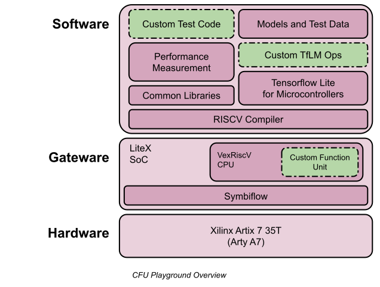
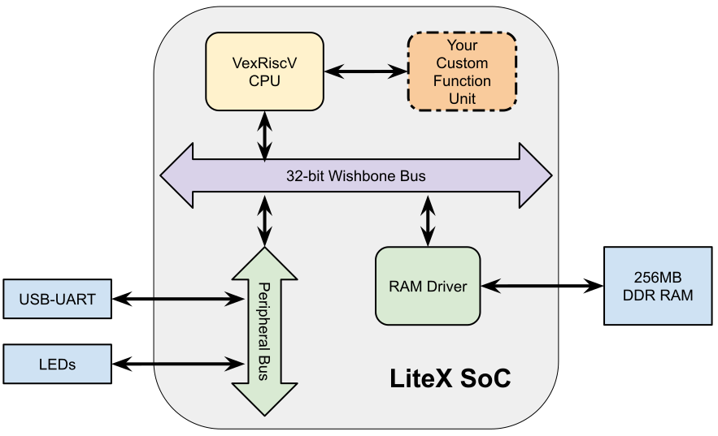

Overview
========

The CFU Playground consists of an opinionated configuration of hardware, 
gateware and software. This page contains a short overview of all of it. 
If this is your first time working with FPGAs or machine learning, then 
we advise skimming this page briefly before moving on to :doc:crash-course.

Hardware
--------

The hardware is based around the Xilinx_ `Artix 7 35T`_ FPGA_. The Artix 7 has:

* 33,000 logic cells, which is sufficient for the soft CPU and quite a bit more
* 90 DSP 'slices', which can be used as multiply-accumulate units
* 50x 32Kbyte block RAMs

We use the `Arty A7`_ development board. As well as the Artix 7, it has: 

* 256MB external DDR DRAM
* a convenient set of switches, buttons and LEDs
* a USB serial connection for a host computer
* LGPL

.. _FPGA: https://en.wikipedia.org/wiki/Field-programmable_gate_array
.. _`Arty A7`: https://store.digilentinc.com/arty-a7-artix-7-fpga-development-board/
.. _Xilinx: https://www.xilinx.com/
.. _`Artix 7 35T`: https://www.xilinx.com/products/silicon-devices/fpga/artix-7.html

Gateware and CFU
----------------

We use LiteX_ to build a standard SoC (System-on-Chip) that runs on the FPGA. 

The SoC has: 

* a VexRiscV_ soft CPU with a Custom Function Unit (CFU) extension
* access to the 256MB of DDR DRAM
* access to the LEDs
* a USB-UART to provide a serial terminal to the host

.. _LiteX: https://github.com/enjoy-digital/litex
.. _VexRiscV: https://github.com/SpinalHDL/VexRiscv

The CPU has an op code allocated to the CFU. When the CPU executes that op
code, it passes the contents of two registers to the CFU, waits for a response
and puts the result back into a third register. A notable feature of this
architecture is that the CFU does not have direct access to memory. It relies
on the CPU to move data back and forth.

CFUs may be written in Verilog or with any tool that outputs Verilog. We prefer
using nMigen_, because it has good support for composition, reuse and unit
testing. The CFU Playground includes nMigen library components to support
CFU development.

We are currently using Vivado_ to synthesize the FPGA bitstream, and intend to move 
to Symbiflow_ in the near future.

.. _nMigen: https://github.com/nmigen/nmigen
.. _Vivado: https://www.xilinx.com/products/design-tools/vivado.html
.. _Symbiflow: https://symbiflow.readthedocs.io/

Software
--------

Programming the LiteX SoC is much the same as programming a traditional microcontroller.
The VexRiscV CPU is a 32 bit RISCV CPU and we use the GCC C/C++ toolchain. The supplied
software includes:

* `Tensorflow Lite for Microcontrollers`_ to do ML model inferencing
* Models to accelerate, and test data for those models
* Library functions to profile and benchmark
* Hooks to allow customisation of Tensorflow and any other part of the system.

.. _`Tensorflow Lite for Microcontrollers`: https://www.tensorflow.org/lite/microcontrollers

