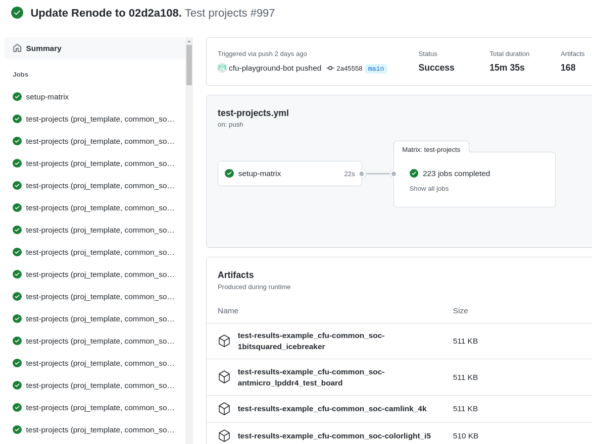

Developing CFU-Playground with Renode
=====================================

`Renode <https://renode.io>`_ is an open source simulation framework provided by `Antmicro <https://antmicro.com>`_ that lets you simulate complex hardware devices and allows you to run the same software you'd normally run on hardware.
A machine can contain various components, including the ones configured on FPGA chips.

Renode's ability to co-simulate with `Verilated code <https://renode.readthedocs.io/en/latest/tutorials/verilator-cosimulation.html>`_ allows CFU Playground users to test their ML accelerators and their software in a deterministic, easily debuggable and fully controlled environment without even having to ever see the target FPGA board and without the need to verilate the whole SoC.

For more information, consult `the Renode documentation <docs.renode.io>`_.

Prerequisites
-------------

To start simulation of your project with Renode you need to set up your machine for building projects first.

Renode itself is installed by default during :doc:`the CFU Playground's setup <setup-guide>`.
Follow the documentation to properly prepare your machine.
Don't worry if you don't have a board necessary for the last *"Step 6: Test Run"* step of the setup guide.
You can treat `Running your project with Renode`_ as a test run step for working with Renode.

You can build and simulate your project in Renode without having any FPGA toolchain installed.
Renode accurately models the memory resources available on a specific board, specified using ``TARGET=<board>``.
Example target boards you can pass to ``make`` commands with ``TARGET=`` include:

* ``icebreaker`` to choose a Lattice FPGA-based iCEBreaker board by 1BitSquared,
* ``digilent_arty`` to choose a Xilinx FPGA-based Arty A7-35T board by Digilent.

By default, if you don't set the ``TARGET`` variable, projects are built for the Arty A7 board.

.. note::

    If you used Conda to set up your machine, make sure to have the ``cfu-common`` environment activated before running any ``make`` commands.
    You can check if it's been activated properly with the ``conda env list`` command which should print ``cfu-common`` followed by an asterisk:

        .. code-block:: bash

            $ conda env list
            # conda environments:
            #
            base                     <...>/CFU-Playground/env/conda
            cfu-common            *  <...>/CFU-Playground/env/conda/envs/cfu-common

Running your project with Renode
--------------------------------

Simulating your project in Renode is quite straightforward.
Such an option is embedded in the Makefile configurations of ``proj_template`` so in all projects based on it all you need to do is run the ``make renode`` command in the project's directory.

For example you can simulate the ``example_cfu`` project in Renode by running these commands from the CFU-Playground's root directory:

.. code-block:: bash

    CFU-Playground $ cd proj/example_cfu
    CFU-Playground/proj/example_cfu $ make renode  # Use 'make renode-headless' to run Renode without GUI.

.. note::

    In case of a failure, e.g., due to the *"ModuleNotFoundError: No module named 'nmigen'"* or *"OSError: Unable to find any of the cross compilation toolchains"* errors, make sure you followed the `Prerequisites`_ closely.

The project will be built the first time you run it in Renode.
Then the Renode's monitor and analyzer (for UART communication) windows should open.
The simulation logs will be output to the shell terminal Renode has been started from.

To **exit** Renode, type ``quit`` at the prompt in the monitor window.

Using Renode without GUI
++++++++++++++++++++++++

If you wish to run Renode without GUI, use the make's ``renode-headless`` target instead of the ``renode`` target.
In a headless mode (more precisely: `a console headless mode <https://renode.readthedocs.io/en/latest/basic/running.html#headless-mode>`_), the Renode's Monitor and an analyzer for the UART communication share the input and output streams.

`Switching between the Monitor and UART is pretty straightforward in Renode. <https://renode.readthedocs.io/en/latest/basic/running.html#uart-interactions-in-the-monitor>`_
By default, you will be connected to a UART session after running ``make renode-headless``.
You can switch to the Monitor by pressing the ``<ESC>`` key.
After running some Renode commands you can return to the UART session with the ``uart_connect sysbus.uart`` command.

.. note::

    Renode simulation logs in a headless mode are suppressed by default for a readable Monitor and UART communication.
    `To save logs to a file, use the Renode's <https://renode.readthedocs.io/en/latest/basic/logger.html#logging-to-file>`_ ``logFile @some_file_name`` command.
    Make sure you have switched to the Monitor before entering the command.

.. note::

    Switching between the Monitor and UART is an action the software isn't aware of.
    Therefore after switching back to UART you might not see its latest output.
    You can, however, refresh the UART output by pressing ``<ENTER>``.

Attaching GDB
-------------

You can use `the GNU debugger <https://www.sourceware.org/gdb/>`_ with your project running in Renode.
The Renode script generated by CFU-Playground's Makefile starts the GDB server on the local ``10001`` port by default.
Therefore after running GDB with ``build/software.elf`` executable, you can attach it to Renode with the ``target remote :10001`` command.

Remember to use ``step[i] N``, ``next[i] N`` or ``continue`` in GDB for the simulation to advance.
The software won't react to UART interaction when GDB awaits the user input.

An example of checking RISC-V registers with GDB for Renode running the ``example_cfu`` project on a simulated 1BitSquared iCEBreaker board:

.. code-block:: bash

    CFU-Playground/proj/example_cfu $ riscv32-elf-gdb build/software.elf
    GNU gdb ...
    ...
    Reading symbols from software.elf...
    # Run 'make renode' or 'make renode-headless' from a different shell before running the 'target remote' command.
    (gdb) target remote :10001
    Remote debugging using :10001
    0x8009f918 in uart_read_nonblock () at CFU-Playground/third_party/python/litex/litex/soc/software/libbase/uart.c:75
    75		return (rx_consume != rx_produce);
    (gdb) br bit_reverse
    Breakpoint 1 at 0x80031d0c: file src/software_cfu.cc, line 28.
    (gdb) continue
    Continuing.
    # Started a 'hw/sw compare tests' (2 -> c) through Renode.
    Breakpoint 1, 0x80031d0c in (anonymous namespace)::bit_reverse (rs1=<optimized out>)
    at src/software_cfu.cc:28
    28	    rs2 >>= 8;
    (gdb) info all-registers
    zero           0x0	0
    ra             0x80030bd4	0x80030bd4 <(anonymous namespace)::do_compare_tests()+188>
    sp             ...
    ...

.. note::

    Your GDB might have a different name, e.g. ``riscv64-unknown-elf-gdb``.
    It depends on how you installed the RISC-V toolchain or the GDB itself but as long as it targets the RISC-V ISA it should work well.

Creating a trace of the execution
---------------------------------

A trace of the execution can be created in Renode using the ``LogFunctionNames`` command on the CPU peripheral (``sysbus.cpu``).
Names of the functions will be printed to a log during execution.

For example after running these commands in the Monitor:

.. code-block::

    Renode, version 1.12.0.4321 (47a5d2ff-202201210224)
    (monitor) s @icebreaker.resc  # This command is run automatically by 'make renode'.
    (icebreaker) logFile @test.log
    (icebreaker) sysbus.cpu LogFunctionNames true true

Renode will print an address and a function name with each function change during the simulation (the "comments" show external actions which influence the log):

::

    # Monitor: Executing 'logFile' and 'LogFunctionNames' commands.
    11:55:59.2861 [INFO] icebreaker: Machine paused.
    11:55:59.2862 [INFO] icebreaker: Machine resumed.
    11:55:59.3868 [INFO] cpu: Entering function litex_getc at 0x8009F910
    # UART: Writing '8'.
    11:56:12.8248 [INFO] cpu: Entering function trap_entry (entry) at 0x8009F6DC
    11:56:12.8248 [INFO] cpu: Entering function trap_handler (entry) at 0x80030020
    11:56:12.8249 [INFO] cpu: Entering function uart_isr (entry) at 0x8009FAE4
    11:56:12.8250 [INFO] cpu: Entering function trap_entry+0x84 (guessed) at 0x8009F760
    11:56:12.8250 [INFO] cpu: Entering function litex_getc at 0x8009F910
    11:56:12.8251 [INFO] cpu: Entering function getc at 0x800A5538
    11:56:12.8251 [INFO] cpu: Entering function readchar at 0x80030848
    ...

.. note::

    You can omit the ``logFile`` command if you run Renode with GUI.
    Unless the log is hidden explicitly it will be printed to the console Renode was started from.

You can find more information, e.g. on how to filter functions by their names, `in the Renode's logging documentation <https://renode.readthedocs.io/en/latest/basic/logger.html#creating-a-trace-of-the-execution>`_.

Generating Verilator waveforms (traces)
---------------------------------------

Generating waveform (trace) files is `an optional feature of the Verilator simulation <https://veripool.org/guide/latest/faq.html#how-do-i-generate-waveforms-traces-in-c>`_.

The build system for Renode Verilated blocks (see ``common/renode-verilator-integration/CMakeLists.txt`` and ``proj/proj.mk``) supports generating such waveform files.
To have a standard VCD waveform generated by Verilator, set Makefile's ``ENABLE_TRACE_ARG`` variable to ``--trace``.
To have an optimized GTKWave's FST files generated, set the variable to the ``--trace-fst`` value instead.

The optional `depth of tracing <https://veripool.org/guide/latest/faq.html#how-do-i-speed-up-writing-large-waveform-trace-files>`_ can be set with Makefile's ``VERILATOR_TRACE_DEPTH`` variable.
When used without the ``ENABLE_TRACE_ARG`` argument, the latter will automatically be set to ``--trace``.

By default, trace files are saved either as ``build/simx.vcd`` if the ``--trace`` argument was used or as ``build/simx.fst`` for ``--trace-fst``.
You can change the default path of the trace files using Makefile's ``VERILATOR_TRACE_PATH`` variable.

For example, the FST trace of only the top signals will be generated as ``/tmp/vtrace`` during the simulation if you use such a command to run your project with Renode:

.. code-block:: bash

    CFU-Playground/proj/my_project $ make ENABLE_TRACE_ARG=--trace-fst VERILATOR_TRACE_DEPTH=1 VERILATOR_TRACE_PATH=/tmp/vtrace.fst renode

.. note::

    With the FST format there's always also the additional ``*.hier`` file generated.

Automated testing
-----------------

Renode's integration with `Robot Framework <https://robotframework.org/>`_ makes it possible to run automated project tests based on test cases defined in the ``.robot`` files.

Run the ``renode-test`` Makefile target from a project's directory to run tests for the given board and project.
For example, you can run the ``example_cfu`` Robot tests on an Arty A7 board simulated by Renode with:

.. code-block:: bash

    CFU-Playground/proj/example_cfu $ make renode-test
    # Building project for the given target and generating Renode scripts.
    ...
    Running <path>/proj/example_cfu/build/renode/digilent_arty.robot
    +++++ Starting test 'digilent_arty.Should Walk The Menu'
    +++++ Finished test 'digilent_arty.Should Walk The Menu' in 4.23 seconds with status OK
    Cleaning up suites
    Closing Renode pid 166260
    Aggregating all robot results
    Output:  <path>/proj/example_cfu/robot_output.xml
    Log:     <path>/proj/example_cfu/log.html
    Report:  <path>/proj/example_cfu/report.html
    Tests finished successfully :)

The Robot file for, e.g., ``my_project`` has to be placed as ``my_project.robot`` in the project's root directory.
This will be a default Renode test definition file for all targets.
Format of the Robot files is quite verbose so analyzing other project's Robot files is a good way for a quick start (see, e.g., `the mnv2_first's main Robot file <https://github.com/google/CFU-Playground/blob/main/proj/mnv2_first/mnv2_first.robot>`_).

.. note::

    Use the ``TARGET`` placeholder wherever target's name is expected, such as when including the Renode Script file name (``.resc``)::

        Execute Command          include @${CURDIR}/TARGET.resc

If a target, e.g. ``my_target``, needs to have a dedicated Robot file besides using ``TARGET``, you can add such a file as ``proj/my_project/renode/my_target.robot``.
The target-dedicated Robot files are prioritized over the ones default for the project placed in its root directory.

The tests can be run directly with Renode test script, which, e.g., allows passing custom flags to the test engine.
For example, you can run just the ``Should Run TFLite Unit Tests`` test case from `the mnv2_first project's Robot file <https://github.com/google/CFU-Playground/blob/main/proj/mnv2_first/mnv2_first.robot>`_ repeatedly 10 times on an Arty A7 target with:

.. code-block:: bash

    CFU-Playground/proj/mnv2_first $ make renode-scripts
    # Building project for the given target and generating Renode scripts.
    ...
    CFU-Playground/proj/mnv2_first $ ../../third_party/renode/renode-test -n 10 -f "TFLite Unit Tests" build/renode/digilent_arty.robot
    Testing fixture: TFLite Unit Tests
    Preparing suites
    Started Renode instance on port 9999; pid 206191
    Starting suites
    Running tests iteration 1 of 10...
    Running build/renode/digilent_arty.robot
    +++++ Starting test 'digilent_arty.Should Run TFLite Unit Tests'
    +++++ Finished test 'digilent_arty.Should Run TFLite Unit Tests' in 1.70 seconds with status OK
    Running tests iteration 2 of 10...
    ...

.. note::

    If you run Renode tests directly, remember to first run the ``renode-scripts`` Makefile target to build a project for the given board.

For more information, check out `Renode's testing documentation <https://renode.readthedocs.io/en/latest/introduction/testing.html>`_ and `Robot Framework's documentation <https://robotframework.org/robotframework>`_.
For more examples, take a look at `many Robot test definition files available in Renode <https://github.com/renode/renode/tree/master/tests>`_.

Testing with GitHub Actions
---------------------------

Correctness of the CFU-Playground project is ensured with Renode simulating various targets in the Github Actions `"Test projects" workflow <https://github.com/google/CFU-Playground/blob/main/.github/workflows/test-projects.yml>`_.
The workflow internally uses `the "Test in Renode" GitHub Action <https://github.com/antmicro/renode-test-action>`_.

Testing is conducted for each project-board pair from the matrix generated by `the generate_ci_matrix.py script <https://github.com/google/CFU-Playground/blob/main/.github/scripts/generate_ci_matrix.py>`_.
Such a pair is created with each project from `the projects_to_test.txt file <https://github.com/google/CFU-Playground/blob/main/.github/workflows/projects_to_test.txt>`_ and each target from `the supported_targets.txt file <https://github.com/google/CFU-Playground/blob/main/.github/workflows/supported_targets.txt>`_ **unless** the target is listed in the given project's ``ci/ci_exclude_targets.txt`` (e.g. `the proj_template's one <https://github.com/google/CFU-Playground/blob/main/proj/proj_template/ci/ci_exclude_targets.txt>`_).

Therefore to add a new project, e.g. ``my_project``, to be tested in CI:

* place the project in the ``proj/my_project`` directory,
* add a ``my_project`` line to the ``.github/workflows/projects_to_test.txt`` file,
* add a `Robot file for Renode <Automatic testing>`_ as ``proj/my_project/my_project.robot``,
* optionally, for each ``special_target`` which requires their own Robot file, add a ``proj/my_projects/renode/special_target.robot`` file (`see for example mvn2_first/renode/hps.robot file <https://github.com/google/CFU-Playground/blob/main/proj/mnv2_first/renode/hps.robot>`_),
* optionally, add a ``proj/my_project/ci/ci_exclude_targets.txt`` file where each line is a target excluded from testing.

To add a new target, e.g. ``my_target``, to be tested in CI:

* add a ``my_target`` line to the ``.github/workflows/supported_targets.txt``,
* for each ``.github/workflows/projects_to_test.txt`` project which you don't want to be tested on the given target, add a ``my_target`` line to the project's ``ci/ci_exclude_targets.txt``.
