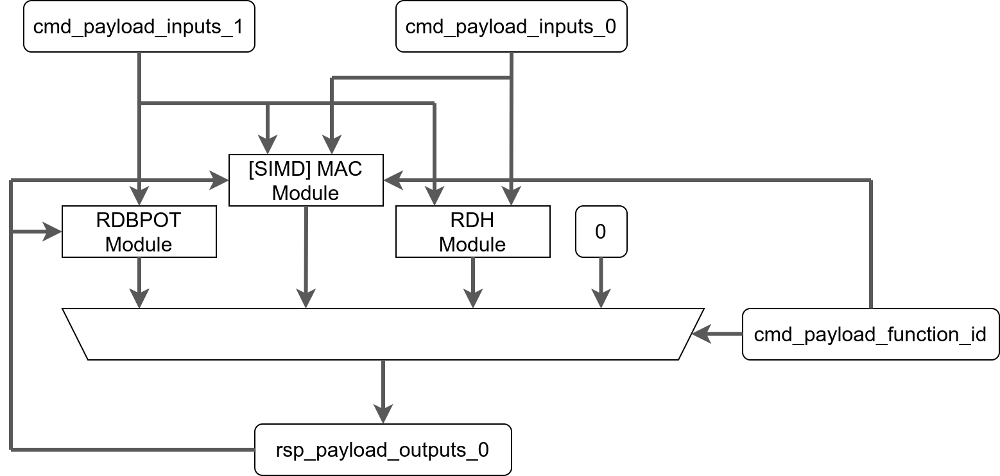
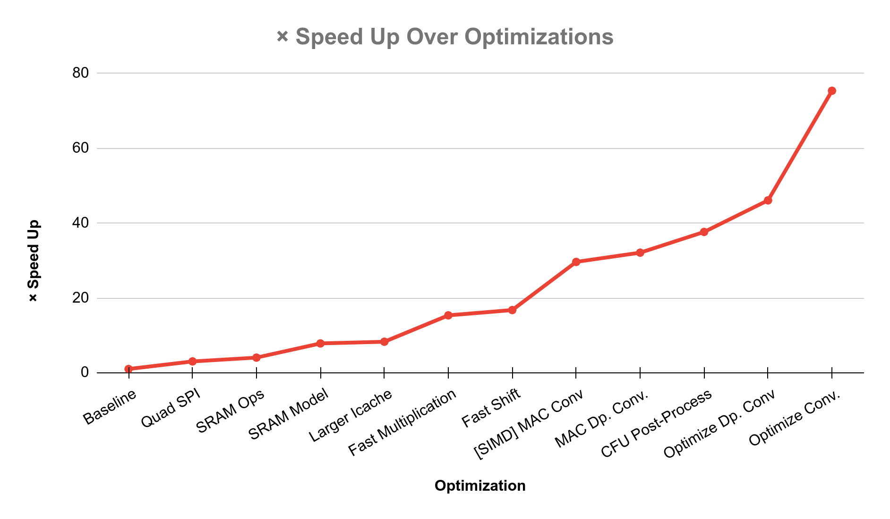
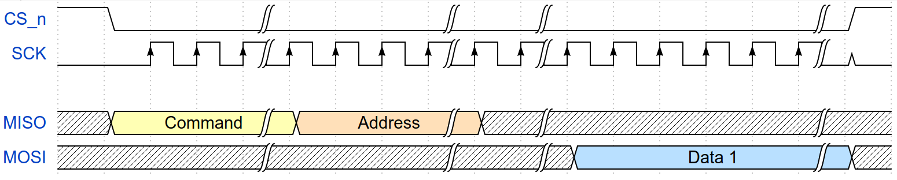
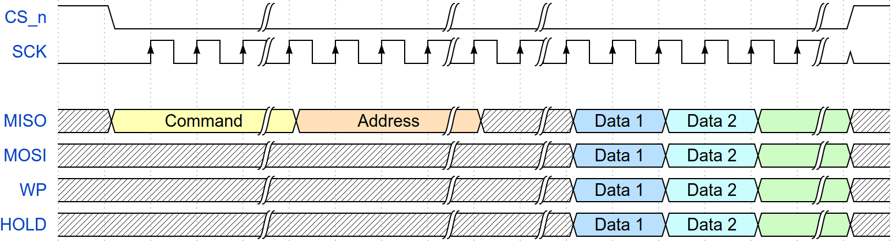
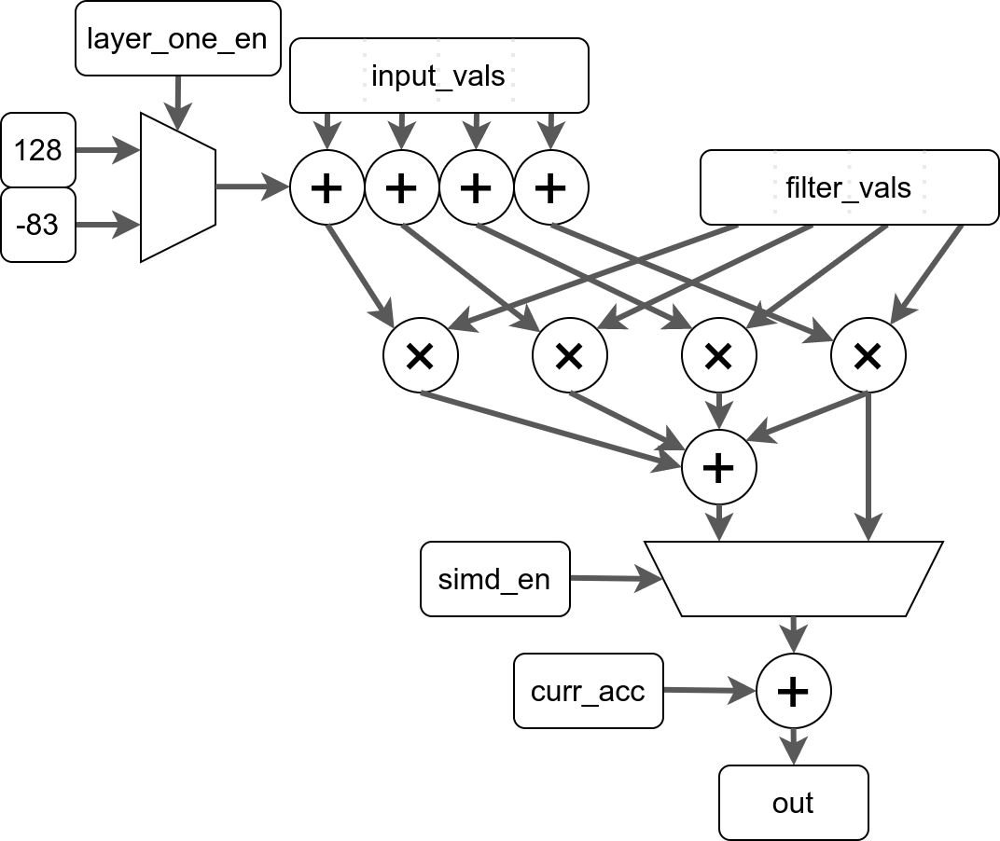

# **Keyword Spotting μ-Accelerator**


**Authors**:      Joseph Bushagour

**Reviewers**:    Tim Callahan, Alan V. Green

**Last updated**: 2021-08-20


## **Objective**


### **Goals:**


*   Utilize the [CFU-Playground](https://github.com/google/CFU-Playground)  to optimize the performance of inference with the [TensorFlow Lite for Microcontrollers](https://www.tensorflow.org/lite/microcontrollers) (TFLM) keyword spotting model from the [MLPerf™ Tiny Deep Learning Benchmarks](https://arxiv.org/abs/2106.07597) with both model-specific software changes and a Custom Function Unit (CFU) that implements model-specific hardware instructions
*   Fit on the constrained resources of the Field Programmable Gate Array (FPGA) boards being used (128KiB of RAM, 2MiB of SPI Flash read-only storage, approximately 500 unused Logic Cells)
*   Bitwise equivalent results before and after optimization


### **Non-Goals:**


*   This project will only be accelerating the keyword spotting model, the changes made during optimization need not be compatible with other models
*   This project will not be sacrificing accuracy of the model for performance
*   This project is not building a large hardware accelerator; with the constrained FPGA resources the hardware optimizations need to be small and effective


## **Background**


### **FPGAs**

Field Programmable Gate Arrays (FPGAs) contain user-configurable hardware (a configuration for which is known as "gateware") which allow project-specific designs to achieve better performance and power consumption than general purpose CPUs. With this unique ability comes significantly greater complexity and challenges in design when compared to traditional software solutions.


### **Soft CPUs**

For this reason, FPGAs are often configured with "soft" CPUs -- CPUs that are implemented entirely within the FPGA gateware that can run software while interacting with custom hardware also configured in the gateware. The FPGAs being used in this project are tiny and quite resource constrained,


### **CFU-Playground**

The CFU-Playground is a framework for accelerating TensorFlow Lite for Microcontrollers (TFLM) models that utilizes the soft-CPU approach with the [VexRiscv](https://github.com/SpinalHDL/VexRiscv) RISC-V core and a Custom Function Unit (CFU) interface that allows custom hardware to connect to the CPU pipeline and operate on custom assembly instructions sent into the CPU. Our CFU will be written in the SystemVerilog Hardware Design Language (HDL).


### **TensorFlow Lite for Microcontrollers**

TensorFlow Lite for Microcontrollers (TFLM) is a subset of Tensorflow Lite that is optimized for usage on embedded systems. The model being accelerated in this project is a speech detection convolutional neural network (CNN) which classifies utterances into one of twelve categories. This model is also part of the MLPerf™ Tiny Deep Learning Benchmarks.


## **Overview**

In order to accelerate the performance of a "Keyword Spotting" TFLM model, we utilize the CFU-Playground to iteratively optimize both software and hardware. Because we are working in a highly resource-constrained FPGA environment, we need to be reserved with our hardware additions and stingy with hardware features that aren't absolutely necessary.

One large area of optimization is the memory hierarchy; hot parts of code and data are consciously placed in fast parts of memory while relatively unused sections of code and data are spilled into slow, read-only memory. Furthermore, the access to slower memory is accelerated by switching how we interface with the memory Integrated Circuit (IC).

A second area of optimization entails the removal of not strictly necessary functionality from the CPU and System on Chip (SoC) in order to have more room for CPU features that increase performance (fast multiplication, shift, etc.). This "trimming" down of the CPU and System on Chip (SoC) was previously explored in the following one-pager document (), but will be further explored in this document.

Finally, a CFU will be designed in hardware that optimizes hot sections of the code (mostly the `CONV_2D` and `DEPTHWISE_CONV_2D` TFLM operations) with custom hardware instructions. This CFU will be comprised of three main modules, all working together as shown in the diagram below:


*   an optionally Single Instruction Multiple Data (SIMD) Multiply and Accumulate (MAC) instruction (called `[SIMD] MAC` in the diagram) which is used in the innermost loops of `CONV_2D` and `DEPTHWISE_CONV_2D`
*   a rounding, clamping, divide by power of two instruction (called `RDBPOT` in the diagram) used in post-processing
*   a rounding, doubling, high 32 bits instruction (called `RDH` in the diagram) which also is used in post-processing





_Note: <code>cmd_payload_input</code>'s represent the input registers, <code>cmd_payload_function_id</code> represents the <code>funct3</code> and <code>funct7</code> sections of an R-type instruction, and <code>rsp_payloads_outputs_0</code> represents the output of the CFU.</em>

Overall, through a series of optimizations, we will accelerate inference on the "Keyword Spotting" model by a little over 75x.





## **Related work**

Three other acceleration projects have been completed in the CFU-Playground repository. None of these three projects have specifically targeted resource constrained FPGAa, and thus none of them fit on our resource constrained board. These projects target the acceleration of different models than our specific keyword spotting model.

Common features of the CFUs in these projects include: [a SIMD multiply and accumulate (MAC) instruction](https://cfu-playground.readthedocs.io/en/latest/step-by-step.html#step-4-simple-calculation-gateware), an instruction to write values into internal CFU registers, and an instruction to read values into internal CFU registers. This project will utilize a SIMD MAC instruction, but no explicit instructions to read or write values into CFU registers for resource usage concerns.


## **Detailed design**

The design of this micro-accelerator can be described as a series of smaller optimizations for inference of the keyword spotting model. The speed of inference is measured in "ticks" where each tick is 1024 clock cycles, these ticks are broken down into the total number of ticks spent in each TFLM Operation (which can be invoked multiple times). Optimizations can be in software, hardware, or both.


#### **Baseline Model Benchmark**

Without any optimizations to the hardware or software the following is the performance of our model:


<table>
  <tr>
   <td style="background-color: #dfe4ec"><em>Tag</em>
   </td>
   <td style="background-color: #8093b3">Tick Sum
   </td>
   <td style="background-color: #8093b3">Tick %
   </td>
  </tr>
  <tr>
   <td style="background-color: #f4f6f8">CONV_2D
   </td>
   <td style="background-color: #ffffff"><p style="text-align: right">
1391803</p>

   </td>
   <td style="background-color: #ffffff"><p style="text-align: right">
75.05%</p>

   </td>
  </tr>
  <tr>
   <td style="background-color: #f4f6f8">DEPTHWISE_CONV_2D
   </td>
   <td style="background-color: #ffffff"><p style="text-align: right">
456688</p>

   </td>
   <td style="background-color: #ffffff"><p style="text-align: right">
24.63%</p>

   </td>
  </tr>
  <tr>
   <td style="background-color: #f4f6f8">AVERAGE_POOL_2D
   </td>
   <td style="background-color: #ffffff"><p style="text-align: right">
4808</p>

   </td>
   <td style="background-color: #ffffff"><p style="text-align: right">
0.26%</p>

   </td>
  </tr>
  <tr>
   <td style="background-color: #f4f6f8">SOFTMAX
   </td>
   <td style="background-color: #ffffff"><p style="text-align: right">
813</p>

   </td>
   <td style="background-color: #ffffff"><p style="text-align: right">
0.04%</p>

   </td>
  </tr>
  <tr>
   <td style="background-color: #f4f6f8">FULLY_CONNECTED
   </td>
   <td style="background-color: #ffffff"><p style="text-align: right">
250</p>

   </td>
   <td style="background-color: #ffffff"><p style="text-align: right">
0.01%</p>

   </td>
  </tr>
  <tr>
   <td style="background-color: #f4f6f8">RESHAPE
   </td>
   <td style="background-color: #ffffff"><p style="text-align: right">
41</p>

   </td>
   <td style="background-color: #ffffff"><p style="text-align: right">
0.00%</p>

   </td>
  </tr>
  <tr>
   <td style="background-color: #dfe4ec"><strong>Grand Total</strong>
   </td>
   <td style="background-color: #dfe4ec"><p style="text-align: right">
<strong>1854403</strong></p>

   </td>
   <td style="background-color: #dfe4ec"><p style="text-align: right">
<strong>100.00%</strong></p>

   </td>
  </tr>
</table>


And the following is our base resource utilization:


<table>
  <tr>
   <td style="background-color: null"><strong>Resource</strong>
   </td>
   <td style="background-color: null"><strong>Used</strong>
   </td>
   <td style="background-color: null"><strong>Limit</strong>
   </td>
  </tr>
  <tr>
   <td style="background-color: null">ICESTORM_LC
   </td>
   <td style="background-color: null"><p style="text-align: right">
4795</p>

   </td>
   <td style="background-color: null"><p style="text-align: right">
5280</p>

   </td>
  </tr>
  <tr>
   <td style="background-color: null">ICESTORM_RAM
   </td>
   <td style="background-color: null"><p style="text-align: right">
12</p>

   </td>
   <td style="background-color: null"><p style="text-align: right">
30</p>

   </td>
  </tr>
  <tr>
   <td style="background-color: null">ICESTORM_DSP
   </td>
   <td style="background-color: null"><p style="text-align: right">
0</p>

   </td>
   <td style="background-color: null"><p style="text-align: right">
8</p>

   </td>
  </tr>
</table>


*   "ICESTORM\_LC" blocks are general purpose Logic Cells comprised of a look-up-table (LUT), a multiplexer (Mux), and a flip-flop
*   "ICESTORM\_RAM" blocks are sections of general-purpose, fast, tiny RAM
*   "ICESTORM\_DSP" tiles can be configured to quickly perform multiplication


#### **Optimization: Use Quad SPI When Accessing Flash**

**Type of optimization**: Hardware

**Explanation**:

Our boards don't have enough RAM to store the entirety of our software, for that reason, read-only data and code are stored in ROM on an external flash chip. We utilize the Serial Peripheral Interface ([SPI](https://en.wikipedia.org/wiki/Serial_Peripheral_Interface)) to communicate with the external memory, which is inherently a serial protocol. The timing diagram is shown below, but from a high level perspective the command, address, and data are normally all sent serially.





In order to speed up communication, we can enable Quad SPI support on our FPGA. The Quad SPI mode still sends the command and address in serial, but utilizes four lines (adding Write Protect and Hold) for sending back the data in parallel as shown in the timing diagram below. For burst reads (reading many values with one command and address) and Execute In-Place (XIP) mode, this leads to a significant speedup.





**Performance**:


<table>
  <tr>
   <td style="background-color: #dfe4ec"><em>Tag</em>
   </td>
   <td style="background-color: #8093b3">Tick Sum
   </td>
   <td style="background-color: #8093b3">Tick %
   </td>
  </tr>
  <tr>
   <td style="background-color: #f4f6f8">CONV_2D
   </td>
   <td style="background-color: #ffffff"><p style="text-align: right">
467996</p>

   </td>
   <td style="background-color: #ffffff"><p style="text-align: right">
76.64%</p>

   </td>
  </tr>
  <tr>
   <td style="background-color: #f4f6f8">DEPTHWISE_CONV_2D
   </td>
   <td style="background-color: #ffffff"><p style="text-align: right">
141383</p>

   </td>
   <td style="background-color: #ffffff"><p style="text-align: right">
23.15%</p>

   </td>
  </tr>
  <tr>
   <td style="background-color: #f4f6f8">AVERAGE_POOL_2D
   </td>
   <td style="background-color: #ffffff"><p style="text-align: right">
979</p>

   </td>
   <td style="background-color: #ffffff"><p style="text-align: right">
0.16%</p>

   </td>
  </tr>
  <tr>
   <td style="background-color: #f4f6f8">SOFTMAX
   </td>
   <td style="background-color: #ffffff"><p style="text-align: right">
146</p>

   </td>
   <td style="background-color: #ffffff"><p style="text-align: right">
0.02%</p>

   </td>
  </tr>
  <tr>
   <td style="background-color: #f4f6f8">FULLY_CONNECTED
   </td>
   <td style="background-color: #ffffff"><p style="text-align: right">
130</p>

   </td>
   <td style="background-color: #ffffff"><p style="text-align: right">
0.02%</p>

   </td>
  </tr>
  <tr>
   <td style="background-color: #f4f6f8">RESHAPE
   </td>
   <td style="background-color: #ffffff"><p style="text-align: right">
10</p>

   </td>
   <td style="background-color: #ffffff"><p style="text-align: right">
0.00%</p>

   </td>
  </tr>
  <tr>
   <td style="background-color: #dfe4ec"><strong>Grand Total</strong>
   </td>
   <td style="background-color: #dfe4ec"><p style="text-align: right">
<strong>610644</strong></p>

   </td>
   <td style="background-color: #dfe4ec"><p style="text-align: right">
<strong>100.00%</strong></p>

   </td>
  </tr>
</table>


**Resource Utilization**:


<table>
  <tr>
   <td style="background-color: null"><strong>Resource</strong>
   </td>
   <td style="background-color: null"><strong>Used</strong>
   </td>
   <td style="background-color: null"><strong>Limit</strong>
   </td>
  </tr>
  <tr>
   <td style="background-color: null">ICESTORM_LC
   </td>
   <td style="background-color: null"><p style="text-align: right">
5117 (+322)</p>

   </td>
   <td style="background-color: null"><p style="text-align: right">
5280</p>

   </td>
  </tr>
  <tr>
   <td style="background-color: null">ICESTORM_RAM
   </td>
   <td style="background-color: null"><p style="text-align: right">
12 (-0)</p>

   </td>
   <td style="background-color: null"><p style="text-align: right">
30</p>

   </td>
  </tr>
  <tr>
   <td style="background-color: null">ICESTORM_DSP
   </td>
   <td style="background-color: null"><p style="text-align: right">
0 (-0)</p>

   </td>
   <td style="background-color: null"><p style="text-align: right">
8</p>

   </td>
  </tr>
</table>


**Incremental Speedup**: **3.04x** faster

**Total Cumulative Speedup With Previous Optimizations**: **3.04x** faster


#### **Optimization: Link Code for Select Tensorflow Operations in SRAM**

**Type of optimization**: Software and Hardware

**Explanation**:

Due to the limited SRAM of the FPGAs being targeted (128KiB), the `.text` and `.rodata` sections of the executable can't be linked in SRAM and instead must be placed in the significantly slower SPI flash storage. This optimization selectively places the code for `CONV_2D` and `DEPTHWISE_CONV_2D` operations in SRAM by annotating each operation's `Eval` function with the GCC section attribute:


```
/* -snip- */
TfLiteStatus Eval(
   TfLiteContext*, TfLiteNode*) __attribute__((section(".ramtext")));
/* -snip- */
```


**Performance**:


<table>
  <tr>
   <td style="background-color: #dfe4ec"><em>Tag</em>
   </td>
   <td style="background-color: #8093b3">Tick Sum
   </td>
   <td style="background-color: #8093b3">Tick %
   </td>
  </tr>
  <tr>
   <td style="background-color: #f4f6f8">CONV_2D
   </td>
   <td style="background-color: #ffffff"><p style="text-align: right">
383044</p>

   </td>
   <td style="background-color: #ffffff"><p style="text-align: right">
83.64%</p>

   </td>
  </tr>
  <tr>
   <td style="background-color: #f4f6f8">DEPTHWISE_CONV_2D
   </td>
   <td style="background-color: #ffffff"><p style="text-align: right">
73675</p>

   </td>
   <td style="background-color: #ffffff"><p style="text-align: right">
16.09%</p>

   </td>
  </tr>
  <tr>
   <td style="background-color: #f4f6f8">AVERAGE_POOL_2D
   </td>
   <td style="background-color: #ffffff"><p style="text-align: right">
970</p>

   </td>
   <td style="background-color: #ffffff"><p style="text-align: right">
0.21%</p>

   </td>
  </tr>
  <tr>
   <td style="background-color: #f4f6f8">SOFTMAX
   </td>
   <td style="background-color: #ffffff"><p style="text-align: right">
145</p>

   </td>
   <td style="background-color: #ffffff"><p style="text-align: right">
0.03%</p>

   </td>
  </tr>
  <tr>
   <td style="background-color: #f4f6f8">FULLY_CONNECTED
   </td>
   <td style="background-color: #ffffff"><p style="text-align: right">
129</p>

   </td>
   <td style="background-color: #ffffff"><p style="text-align: right">
0.03%</p>

   </td>
  </tr>
  <tr>
   <td style="background-color: #f4f6f8">RESHAPE
   </td>
   <td style="background-color: #ffffff"><p style="text-align: right">
9</p>

   </td>
   <td style="background-color: #ffffff"><p style="text-align: right">
0.00%</p>

   </td>
  </tr>
  <tr>
   <td style="background-color: #dfe4ec"><strong>Grand Total</strong>
   </td>
   <td style="background-color: #dfe4ec"><p style="text-align: right">
<strong>457972</strong></p>

   </td>
   <td style="background-color: #dfe4ec"><p style="text-align: right">
<strong>100.00%</strong></p>

   </td>
  </tr>
</table>


**Resource Utilization**:


<table>
  <tr>
   <td style="background-color: null"><strong>Resource</strong>
   </td>
   <td style="background-color: null"><strong>Used</strong>
   </td>
   <td style="background-color: null"><strong>Limit</strong>
   </td>
  </tr>
  <tr>
   <td style="background-color: null">ICESTORM_LC
   </td>
   <td style="background-color: null"><p style="text-align: right">
5117 (-0)</p>

   </td>
   <td style="background-color: null"><p style="text-align: right">
5280</p>

   </td>
  </tr>
  <tr>
   <td style="background-color: null">ICESTORM_RAM
   </td>
   <td style="background-color: null"><p style="text-align: right">
12 (-0)</p>

   </td>
   <td style="background-color: null"><p style="text-align: right">
30</p>

   </td>
  </tr>
  <tr>
   <td style="background-color: null">ICESTORM_DSP
   </td>
   <td style="background-color: null"><p style="text-align: right">
0 (-0)</p>

   </td>
   <td style="background-color: null"><p style="text-align: right">
8</p>

   </td>
  </tr>
</table>


**Incremental Speedup**: **1.33x** faster

**Total Cumulative Speedup With Previous Optimizations**: **4.05x** faster


#### **Optimization: Link Model in SRAM**

**Type of optimization**: Software and Hardware

**Explanation**:

Similar to the previous optimization, by "pinning" our model weights in SRAM using the `section` attribute we can avoid the need to read from SPI Flash inside of our hot loops. This is even more important than linking the code for `CONV_2D` and `DEPTHWISE_CONV_2D` operations in SRAM because while we have a small instruction cache, we don't have any data cache.

**Performance**:


<table>
  <tr>
   <td style="background-color: #dfe4ec"><em>Tag</em>
   </td>
   <td style="background-color: #8093b3">Tick Sum
   </td>
   <td style="background-color: #8093b3">Tick %
   </td>
  </tr>
  <tr>
   <td style="background-color: #f4f6f8">CONV_2D
   </td>
   <td style="background-color: #ffffff"><p style="text-align: right">
179250</p>

   </td>
   <td style="background-color: #ffffff"><p style="text-align: right">
75.77%</p>

   </td>
  </tr>
  <tr>
   <td style="background-color: #f4f6f8">DEPTHWISE_CONV_2D
   </td>
   <td style="background-color: #ffffff"><p style="text-align: right">
56113</p>

   </td>
   <td style="background-color: #ffffff"><p style="text-align: right">
23.72%</p>

   </td>
  </tr>
  <tr>
   <td style="background-color: #f4f6f8">AVERAGE_POOL_2D
   </td>
   <td style="background-color: #ffffff"><p style="text-align: right">
989</p>

   </td>
   <td style="background-color: #ffffff"><p style="text-align: right">
0.42%</p>

   </td>
  </tr>
  <tr>
   <td style="background-color: #f4f6f8">SOFTMAX
   </td>
   <td style="background-color: #ffffff"><p style="text-align: right">
146</p>

   </td>
   <td style="background-color: #ffffff"><p style="text-align: right">
0.06%</p>

   </td>
  </tr>
  <tr>
   <td style="background-color: #f4f6f8">FULLY_CONNECTED
   </td>
   <td style="background-color: #ffffff"><p style="text-align: right">
63</p>

   </td>
   <td style="background-color: #ffffff"><p style="text-align: right">
0.03%</p>

   </td>
  </tr>
  <tr>
   <td style="background-color: #f4f6f8">RESHAPE
   </td>
   <td style="background-color: #ffffff"><p style="text-align: right">
9</p>

   </td>
   <td style="background-color: #ffffff"><p style="text-align: right">
0.00%</p>

   </td>
  </tr>
  <tr>
   <td style="background-color: #dfe4ec"><strong>Grand Total</strong>
   </td>
   <td style="background-color: #dfe4ec"><p style="text-align: right">
<strong>236570</strong></p>

   </td>
   <td style="background-color: #dfe4ec"><p style="text-align: right">
<strong>100.00%</strong></p>

   </td>
  </tr>
</table>


**Resource Utilization**:


<table>
  <tr>
   <td style="background-color: null"><strong>Resource</strong>
   </td>
   <td style="background-color: null"><strong>Used</strong>
   </td>
   <td style="background-color: null"><strong>Limit</strong>
   </td>
  </tr>
  <tr>
   <td style="background-color: null">ICESTORM_LC
   </td>
   <td style="background-color: null"><p style="text-align: right">
5117 (-0)</p>

   </td>
   <td style="background-color: null"><p style="text-align: right">
5280</p>

   </td>
  </tr>
  <tr>
   <td style="background-color: null">ICESTORM_RAM
   </td>
   <td style="background-color: null"><p style="text-align: right">
12 (-0)</p>

   </td>
   <td style="background-color: null"><p style="text-align: right">
30</p>

   </td>
  </tr>
  <tr>
   <td style="background-color: null">ICESTORM_DSP
   </td>
   <td style="background-color: null"><p style="text-align: right">
0 (-0)</p>

   </td>
   <td style="background-color: null"><p style="text-align: right">
8</p>

   </td>
  </tr>
</table>


**Incremental Speedup**: **1.94x** faster

**Total Cumulative Speedup With Previous Optimizations**: **7.84x** faster


#### **Optimization: Increase Size of Instruction Cache**

**Type of optimization**: Hardware

**Explanation**:

By increasing the size of the instruction cache, we can decrease the number of cache misses and therefore decrease Average Memory Access Time (AMAT). Despite the fact that increasing the size of the instruction cache is cheap in terms of LCs (because we can make use of the Embedded Block Ram (EBR) primitives in the cache), cheap isn't free and we don't have enough LCs to fit more of the instruction cache.

To get around this, we removed as many unnecessary Control and Status Registers (CSRs) and features of the System on Chip (SoC) from our build as we could. This entailed the removal of the hardware timer, which disables usage of the `time.h` standard library and the BIOS (which is a nice feature for debug purposes, but because we normally overwrite this with our own binary it's not strictly necessary). We also removed registers meant for resetting the SoC and CPU.

**Performance**:


<table>
  <tr>
   <td style="background-color: #dfe4ec"><em>Tag</em>
   </td>
   <td style="background-color: #8093b3">Tick Sum
   </td>
   <td style="background-color: #8093b3">Tick %
   </td>
  </tr>
  <tr>
   <td style="background-color: #f4f6f8">CONV_2D
   </td>
   <td style="background-color: #ffffff"><p style="text-align: right">
170591</p>

   </td>
   <td style="background-color: #ffffff"><p style="text-align: right">
76.32%</p>

   </td>
  </tr>
  <tr>
   <td style="background-color: #f4f6f8">DEPTHWISE_CONV_2D
   </td>
   <td style="background-color: #ffffff"><p style="text-align: right">
51963</p>

   </td>
   <td style="background-color: #ffffff"><p style="text-align: right">
23.25%</p>

   </td>
  </tr>
  <tr>
   <td style="background-color: #f4f6f8">AVERAGE_POOL_2D
   </td>
   <td style="background-color: #ffffff"><p style="text-align: right">
807</p>

   </td>
   <td style="background-color: #ffffff"><p style="text-align: right">
0.36%</p>

   </td>
  </tr>
  <tr>
   <td style="background-color: #f4f6f8">SOFTMAX
   </td>
   <td style="background-color: #ffffff"><p style="text-align: right">
98</p>

   </td>
   <td style="background-color: #ffffff"><p style="text-align: right">
0.04%</p>

   </td>
  </tr>
  <tr>
   <td style="background-color: #f4f6f8">FULLY_CONNECTED
   </td>
   <td style="background-color: #ffffff"><p style="text-align: right">
62</p>

   </td>
   <td style="background-color: #ffffff"><p style="text-align: right">
0.03%</p>

   </td>
  </tr>
  <tr>
   <td style="background-color: #f4f6f8">RESHAPE
   </td>
   <td style="background-color: #ffffff"><p style="text-align: right">
7</p>

   </td>
   <td style="background-color: #ffffff"><p style="text-align: right">
0.00%</p>

   </td>
  </tr>
  <tr>
   <td style="background-color: #dfe4ec"><strong>Grand Total</strong>
   </td>
   <td style="background-color: #dfe4ec"><p style="text-align: right">
<strong>223528</strong></p>

   </td>
   <td style="background-color: #dfe4ec"><p style="text-align: right">
<strong>100.00%</strong></p>

   </td>
  </tr>
</table>


**Resource Utilization**:


<table>
  <tr>
   <td style="background-color: null"><strong>Resource</strong>
   </td>
   <td style="background-color: null"><strong>Used</strong>
   </td>
   <td style="background-color: null"><strong>Limit</strong>
   </td>
  </tr>
  <tr>
   <td style="background-color: null">ICESTORM_LC
   </td>
   <td style="background-color: null"><p style="text-align: right">
4635 (-482)</p>

   </td>
   <td style="background-color: null"><p style="text-align: right">
5280</p>

   </td>
  </tr>
  <tr>
   <td style="background-color: null">ICESTORM_RAM
   </td>
   <td style="background-color: null"><p style="text-align: right">
14 (+2)</p>

   </td>
   <td style="background-color: null"><p style="text-align: right">
30</p>

   </td>
  </tr>
  <tr>
   <td style="background-color: null">ICESTORM_DSP
   </td>
   <td style="background-color: null"><p style="text-align: right">
0 (-0)</p>

   </td>
   <td style="background-color: null"><p style="text-align: right">
8</p>

   </td>
  </tr>
</table>


**Incremental Speedup**: **1.05x** faster

**Total Cumulative Speedup With Previous Optimizations**: **8.30x** faster


#### **Optimization: Switch to Single Cycle Multiplication**

**Type of optimization**: Hardware

**Explanation**:

Because of our previous LC-saving changes, we have room to add single-cycle multiplication (rather than our iterative ≈30 cycle multiplication) in our CPU. This uses 4 of our DSP tiles, but the cost is well worth the performance increase.

**Performance**:


<table>
  <tr>
   <td style="background-color: #dfe4ec"><em>Tag</em>
   </td>
   <td style="background-color: #8093b3">Tick Sum
   </td>
   <td style="background-color: #8093b3">Tick %
   </td>
  </tr>
  <tr>
   <td style="background-color: #f4f6f8">CONV_2D
   </td>
   <td style="background-color: #ffffff"><p style="text-align: right">
87365</p>

   </td>
   <td style="background-color: #ffffff"><p style="text-align: right">
72.31%</p>

   </td>
  </tr>
  <tr>
   <td style="background-color: #f4f6f8">DEPTHWISE_CONV_2D
   </td>
   <td style="background-color: #ffffff"><p style="text-align: right">
32527</p>

   </td>
   <td style="background-color: #ffffff"><p style="text-align: right">
26.92%</p>

   </td>
  </tr>
  <tr>
   <td style="background-color: #f4f6f8">AVERAGE_POOL_2D
   </td>
   <td style="background-color: #ffffff"><p style="text-align: right">
795</p>

   </td>
   <td style="background-color: #ffffff"><p style="text-align: right">
0.66%</p>

   </td>
  </tr>
  <tr>
   <td style="background-color: #f4f6f8">SOFTMAX
   </td>
   <td style="background-color: #ffffff"><p style="text-align: right">
89</p>

   </td>
   <td style="background-color: #ffffff"><p style="text-align: right">
0.07%</p>

   </td>
  </tr>
  <tr>
   <td style="background-color: #f4f6f8">FULLY_CONNECTED
   </td>
   <td style="background-color: #ffffff"><p style="text-align: right">
37</p>

   </td>
   <td style="background-color: #ffffff"><p style="text-align: right">
0.03%</p>

   </td>
  </tr>
  <tr>
   <td style="background-color: #f4f6f8">RESHAPE
   </td>
   <td style="background-color: #ffffff"><p style="text-align: right">
7</p>

   </td>
   <td style="background-color: #ffffff"><p style="text-align: right">
0.01%</p>

   </td>
  </tr>
  <tr>
   <td style="background-color: #dfe4ec"><strong>Grand Total</strong>
   </td>
   <td style="background-color: #dfe4ec"><p style="text-align: right">
<strong>120820</strong></p>

   </td>
   <td style="background-color: #dfe4ec"><p style="text-align: right">
<strong>100.00%</strong></p>

   </td>
  </tr>
</table>


**Resource Utilization**:


<table>
  <tr>
   <td style="background-color: null"><strong>Resource</strong>
   </td>
   <td style="background-color: null"><strong>Used</strong>
   </td>
   <td style="background-color: null"><strong>Limit</strong>
   </td>
  </tr>
  <tr>
   <td style="background-color: null">ICESTORM_LC
   </td>
   <td style="background-color: null"><p style="text-align: right">
4732 (+97)</p>

   </td>
   <td style="background-color: null"><p style="text-align: right">
5280</p>

   </td>
  </tr>
  <tr>
   <td style="background-color: null">ICESTORM_RAM
   </td>
   <td style="background-color: null"><p style="text-align: right">
14 (-0)</p>

   </td>
   <td style="background-color: null"><p style="text-align: right">
30</p>

   </td>
  </tr>
  <tr>
   <td style="background-color: null">ICESTORM_DSP
   </td>
   <td style="background-color: null"><p style="text-align: right">
4 (+4)</p>

   </td>
   <td style="background-color: null"><p style="text-align: right">
8</p>

   </td>
  </tr>
</table>


**Incremental Speedup**: **1.85x** faster

**Total Cumulative Speedup With Previous Optimizations**: **15.35x** faster


#### **Optimization: Switch to Single Cycle Shift**

**Type of optimization**: Hardware

**Explanation**:

The addition of a single-cycle [Barrel Shifter](https://en.wikipedia.org/wiki/Barrel_shifter) to our CPU was previously not possible due to the LC usage from the 5 levels of multiplexers required to implement an arbitrary single cycle shift. The previous cycle iteratively shifted by one each clock cycle meaning that, in the worst case, we could spend more than 30 cycles on a single bit-shift instruction (stalling the pipeline as well). With the aforementioned resources from removing unneeded CSRs and SoC features we now have enough logic cells to implement a single-cycle shift.

**Performance**:


<table>
  <tr>
   <td style="background-color: #dfe4ec"><em>Tag</em>
   </td>
   <td style="background-color: #8093b3">Tick Sum
   </td>
   <td style="background-color: #8093b3">Tick %
   </td>
  </tr>
  <tr>
   <td style="background-color: #f4f6f8">CONV_2D
   </td>
   <td style="background-color: #ffffff"><p style="text-align: right">
81912</p>

   </td>
   <td style="background-color: #ffffff"><p style="text-align: right">
74.04%</p>

   </td>
  </tr>
  <tr>
   <td style="background-color: #f4f6f8">DEPTHWISE_CONV_2D
   </td>
   <td style="background-color: #ffffff"><p style="text-align: right">
27876</p>

   </td>
   <td style="background-color: #ffffff"><p style="text-align: right">
25.20%</p>

   </td>
  </tr>
  <tr>
   <td style="background-color: #f4f6f8">AVERAGE_POOL_2D
   </td>
   <td style="background-color: #ffffff"><p style="text-align: right">
728</p>

   </td>
   <td style="background-color: #ffffff"><p style="text-align: right">
0.66%</p>

   </td>
  </tr>
  <tr>
   <td style="background-color: #f4f6f8">SOFTMAX
   </td>
   <td style="background-color: #ffffff"><p style="text-align: right">
77</p>

   </td>
   <td style="background-color: #ffffff"><p style="text-align: right">
0.07%</p>

   </td>
  </tr>
  <tr>
   <td style="background-color: #f4f6f8">FULLY_CONNECTED
   </td>
   <td style="background-color: #ffffff"><p style="text-align: right">
36</p>

   </td>
   <td style="background-color: #ffffff"><p style="text-align: right">
0.03%</p>

   </td>
  </tr>
  <tr>
   <td style="background-color: #f4f6f8">RESHAPE
   </td>
   <td style="background-color: #ffffff"><p style="text-align: right">
7</p>

   </td>
   <td style="background-color: #ffffff"><p style="text-align: right">
0.01%</p>

   </td>
  </tr>
  <tr>
   <td style="background-color: #dfe4ec"><strong>Grand Total</strong>
   </td>
   <td style="background-color: #dfe4ec"><p style="text-align: right">
<strong>110636</strong></p>

   </td>
   <td style="background-color: #dfe4ec"><p style="text-align: right">
<strong>100.00%</strong></p>

   </td>
  </tr>
</table>


**Resource Utilization**:


<table>
  <tr>
   <td style="background-color: null"><strong>Resource</strong>
   </td>
   <td style="background-color: null"><strong>Used</strong>
   </td>
   <td style="background-color: null"><strong>Limit</strong>
   </td>
  </tr>
  <tr>
   <td style="background-color: null">ICESTORM_LC
   </td>
   <td style="background-color: null"><p style="text-align: right">
4863 (+131)</p>

   </td>
   <td style="background-color: null"><p style="text-align: right">
5280</p>

   </td>
  </tr>
  <tr>
   <td style="background-color: null">ICESTORM_RAM
   </td>
   <td style="background-color: null"><p style="text-align: right">
14 (-0)</p>

   </td>
   <td style="background-color: null"><p style="text-align: right">
30</p>

   </td>
  </tr>
  <tr>
   <td style="background-color: null">ICESTORM_DSP
   </td>
   <td style="background-color: null"><p style="text-align: right">
4 (-0)</p>

   </td>
   <td style="background-color: null"><p style="text-align: right">
8</p>

   </td>
  </tr>
</table>


**Incremental Speedup**: **1.09x** faster

**Total Cumulative Speedup With Previous Optimizations**: **16.76x** faster


#### **Optimization: Use CFU SIMD Multiply and Accumulate in Convolution Operation**

**Type of optimization**: Software and Hardware

**Explanation**:

Approximately 75% of inference is spent in the `CONV_2D` TFLM operation. This operation consists of nested loops 7 layers deep, the innermost loop of which contains a repeated Multiply and Accumulate (MAC) (shown below).


```
/* -snip- */
for (int in_channel = 0; in_channel < input_depth; ++in_channel) {
 int32_t input_val = input_data[Offset(input_shape, batch, in_y,
                                       in_x, in_channel)];
 int32_t filter_val = filter_data[Offset(filter_shape, out_channel, filter_y,
                                         filter_x, in_channel)];
 acc += filter_val * (input_val + input_offset);
}
/* -snip- */
```


The `input_data` and `filter_data` arrays have the data type `int8_t` and each subsequent access to the arrays are contiguous in memory. Because our registers are 32 bits wide it's wasteful to perform 4 array lookups to get 8 bit values, individually performing a software multiply and accumulate on each iteration. Instead, we can write a CFU which takes two 32 bit inputs (each consisting of a set of 4 `int8_t` values from one 32-bit array lookup) and maintains an internal accumulator of the result of each MAC.

One caveat to this solution is that the first layer of convolution has an `input_depth` of one and a different `input_offset` value when compared to the next four layers. For this reason, our SIMD MAC CFU needs the ability to switch `input_offset` values and revert to a regular MAC (without SIMD capabilities). The `funct7` field can control these features.

A block diagram and sample SystemVerilog instantiation of the SIMD MAC is shown below:





```
 // Optionally SIMD multiply and accumulate with input offset.
 logic [31:0] mac_output;
 mac kws_mac (
     .layer_one_en(funct7[1]),  // Switches input_offset to -83
     .simd_en(funct7[0]),       // Turns on SIMD support
     .input_vals(rs1),
     .filter_vals(rs2),
     .curr_acc(cfu_out),        // Current value of the accumulator
     .out(mac_output)           // Next value of the accumulator
 );
```


Using this CFU, we can turn the innermost loop for most convolution layers into the following (the first convolution layer will look almost identical, but only reading in one value at a time from each array and doing a MAC rather than a SIMD MAC):


```
/* -snip- */
for (int in_channel = 0; in_channel < input_depth; in_channel += 4) {
  uint32_t input_val =
     *((uint32_t*)(input_data + Offset(input_shape, 0, out_y,
                                       out_x, in_channel)));
  uint32_t filter_val =
     *((uint32_t*)(filter_data + Offset(filter_shape, out_channel,
                                        0, 0, in_channel)));
  acc = CFU_SIMD_MAC(input_val, filter_val);
}
/* -snip- */
```


This decreases the time we spend in our innermost loop, greatly decreasing cycles used for convolution.

**Performance**:


<table>
  <tr>
   <td style="background-color: #dfe4ec"><em>Tag</em>
   </td>
   <td style="background-color: #8093b3">Tick Sum
   </td>
   <td style="background-color: #8093b3">Tick %
   </td>
  </tr>
  <tr>
   <td style="background-color: #f4f6f8">CONV_2D
   </td>
   <td style="background-color: #ffffff"><p style="text-align: right">
33888</p>

   </td>
   <td style="background-color: #ffffff"><p style="text-align: right">
54.14%</p>

   </td>
  </tr>
  <tr>
   <td style="background-color: #f4f6f8">DEPTHWISE_CONV_2D
   </td>
   <td style="background-color: #ffffff"><p style="text-align: right">
27856</p>

   </td>
   <td style="background-color: #ffffff"><p style="text-align: right">
44.50%</p>

   </td>
  </tr>
  <tr>
   <td style="background-color: #f4f6f8">AVERAGE_POOL_2D
   </td>
   <td style="background-color: #ffffff"><p style="text-align: right">
728</p>

   </td>
   <td style="background-color: #ffffff"><p style="text-align: right">
1.16%</p>

   </td>
  </tr>
  <tr>
   <td style="background-color: #f4f6f8">SOFTMAX
   </td>
   <td style="background-color: #ffffff"><p style="text-align: right">
77</p>

   </td>
   <td style="background-color: #ffffff"><p style="text-align: right">
0.12%</p>

   </td>
  </tr>
  <tr>
   <td style="background-color: #f4f6f8">FULLY_CONNECTED
   </td>
   <td style="background-color: #ffffff"><p style="text-align: right">
36</p>

   </td>
   <td style="background-color: #ffffff"><p style="text-align: right">
0.06%</p>

   </td>
  </tr>
  <tr>
   <td style="background-color: #f4f6f8">RESHAPE
   </td>
   <td style="background-color: #ffffff"><p style="text-align: right">
7</p>

   </td>
   <td style="background-color: #ffffff"><p style="text-align: right">
0.01%</p>

   </td>
  </tr>
  <tr>
   <td style="background-color: #dfe4ec"><strong>Grand Total</strong>
   </td>
   <td style="background-color: #dfe4ec"><p style="text-align: right">
<strong>62592</strong></p>

   </td>
   <td style="background-color: #dfe4ec"><p style="text-align: right">
<strong>100.00%</strong></p>

   </td>
  </tr>
</table>


**Resource Utilization**:


<table>
  <tr>
   <td style="background-color: null"><strong>Resource</strong>
   </td>
   <td style="background-color: null"><strong>Used</strong>
   </td>
   <td style="background-color: null"><strong>Limit</strong>
   </td>
  </tr>
  <tr>
   <td style="background-color: null">ICESTORM_LC
   </td>
   <td style="background-color: null"><p style="text-align: right">
4863 (+41)</p>

   </td>
   <td style="background-color: null"><p style="text-align: right">
5280</p>

   </td>
  </tr>
  <tr>
   <td style="background-color: null">ICESTORM_RAM
   </td>
   <td style="background-color: null"><p style="text-align: right">
14 (-0)</p>

   </td>
   <td style="background-color: null"><p style="text-align: right">
30</p>

   </td>
  </tr>
  <tr>
   <td style="background-color: null">ICESTORM_DSP
   </td>
   <td style="background-color: null"><p style="text-align: right">
8 (+4)</p>

   </td>
   <td style="background-color: null"><p style="text-align: right">
8</p>

   </td>
  </tr>
</table>


**Incremental Speedup**: **1.77x** faster

**Total Cumulative Speedup With Previous Optimizations**: **29.63x** faster


#### **Optimization: Use CFU Multiply and Accumulate in Depthwise Convolution Operation**

**Type of optimization**: Software

**Explanation**:

Similar to the `CONV_2D` operation, the `DEPTHWISE_CONV_2D` operation primarily consists of a multiply and accumulate. Unfortunately, the values utilized in each cycle of the innermost loop are not contiguous in memory. For this reason, we cannot use the SIMD functionality of our CFU MAC. Still, the usage of the MAC decreases cycles used in the `DEPTHWISE_CONV_2D` operation.

**Performance**:


<table>
  <tr>
   <td style="background-color: #dfe4ec"><em>Tag</em>
   </td>
   <td style="background-color: #8093b3">Tick Sum
   </td>
   <td style="background-color: #8093b3">Tick %
   </td>
  </tr>
  <tr>
   <td style="background-color: #f4f6f8">CONV_2D
   </td>
   <td style="background-color: #ffffff"><p style="text-align: right">
33888</p>

   </td>
   <td style="background-color: #ffffff"><p style="text-align: right">
58.66%</p>

   </td>
  </tr>
  <tr>
   <td style="background-color: #f4f6f8">DEPTHWISE_CONV_2D
   </td>
   <td style="background-color: #ffffff"><p style="text-align: right">
23033</p>

   </td>
   <td style="background-color: #ffffff"><p style="text-align: right">
39.87%</p>

   </td>
  </tr>
  <tr>
   <td style="background-color: #f4f6f8">AVERAGE_POOL_2D
   </td>
   <td style="background-color: #ffffff"><p style="text-align: right">
728</p>

   </td>
   <td style="background-color: #ffffff"><p style="text-align: right">
1.26%</p>

   </td>
  </tr>
  <tr>
   <td style="background-color: #f4f6f8">SOFTMAX
   </td>
   <td style="background-color: #ffffff"><p style="text-align: right">
77</p>

   </td>
   <td style="background-color: #ffffff"><p style="text-align: right">
0.13%</p>

   </td>
  </tr>
  <tr>
   <td style="background-color: #f4f6f8">FULLY_CONNECTED
   </td>
   <td style="background-color: #ffffff"><p style="text-align: right">
35</p>

   </td>
   <td style="background-color: #ffffff"><p style="text-align: right">
0.06%</p>

   </td>
  </tr>
  <tr>
   <td style="background-color: #f4f6f8">RESHAPE
   </td>
   <td style="background-color: #ffffff"><p style="text-align: right">
8</p>

   </td>
   <td style="background-color: #ffffff"><p style="text-align: right">
0.01%</p>

   </td>
  </tr>
  <tr>
   <td style="background-color: #dfe4ec"><strong>Grand Total</strong>
   </td>
   <td style="background-color: #dfe4ec"><p style="text-align: right">
<strong>57769</strong></p>

   </td>
   <td style="background-color: #dfe4ec"><p style="text-align: right">
<strong>100.00%</strong></p>

   </td>
  </tr>
</table>


**Resource Utilization**:


<table>
  <tr>
   <td style="background-color: null"><strong>Resource</strong>
   </td>
   <td style="background-color: null"><strong>Used</strong>
   </td>
   <td style="background-color: null"><strong>Limit</strong>
   </td>
  </tr>
  <tr>
   <td style="background-color: null">ICESTORM_LC
   </td>
   <td style="background-color: null"><p style="text-align: right">
4863 (-0)</p>

   </td>
   <td style="background-color: null"><p style="text-align: right">
5280</p>

   </td>
  </tr>
  <tr>
   <td style="background-color: null">ICESTORM_RAM
   </td>
   <td style="background-color: null"><p style="text-align: right">
14 (-0)</p>

   </td>
   <td style="background-color: null"><p style="text-align: right">
30</p>

   </td>
  </tr>
  <tr>
   <td style="background-color: null">ICESTORM_DSP
   </td>
   <td style="background-color: null"><p style="text-align: right">
8 (-0)</p>

   </td>
   <td style="background-color: null"><p style="text-align: right">
8</p>

   </td>
  </tr>
</table>


**Incremental Speedup**: **1.08x** faster

**Total Cumulative Speedup With Previous Optimizations**: **32.10x** faster


#### **Optimization: Move Post-Processing from Software to Gateware**

**Type of optimization**: Software and Hardware

**Explanation**:

In all layers of `CONV_2D` and `DEPTHWISE_CONV_2D`, 5 layers deep in the nested loops is some post-processing code applied to the accumulator. This post processing performs three main operations (two of which are hidden in the `MultiplyByQuantizedMultiplier` function):


*   a `SaturatingDoublingHighMul` operation which performs a saturating multiplication of two values, doubling the result and returning the high 32 bits
*   a `RoundingDivideByPOT` operation which divides by a power of two, correctly rounding up or down based on sign and remainder
*   shifting and clamping based on `output_offset` and our quantized maximum/minimum

```
/* -snip- */
acc = MultiplyByQuantizedMultiplier(
   acc, output_multiplier[out_channel], output_shift[out_channel]);
acc += output_offset;
acc = std::max(acc, output_activation_min);
acc = std::min(acc, output_activation_max);
output_data[Offset(output_shape, batch, out_y, out_x, out_channel)] =
   static_cast<int8_t>(acc);
/* -snip- */
```


This post-processing is time consuming, taking around 70 cycles on each invocation deep inside the loop nest. We can replace this with customized CFU instructions to perform this post-processing in only a couple cycles. One note is that we have no more DSP tiles to use for multiplication in the CFU, for this reason we use the `mul` and `mulh` RISC-V instructions outside the CFU and pass those results in as inputs. This makes our post-processing code look like the following:


```
/* -snip- */
int32_t q_mult = output_multiplier[out_channel];
uint32_t top, bottom;
asm("mul  %[bottom], %[acc], %[q_mult]"
    : [bottom] "=r"(bottom)
    : [acc] "r"(acc), [q_mult] "r"(q_mult));
asm("mulh %[top], %[acc], %[q_mult]"
    : [top] "=r"(top)
    : [acc] "r"(acc), [q_mult] "r"(q_mult));
CFU_ROUNDING_DOUBLE_HIGH(top, bottom);
acc = CFU_ROUNDING_CLAMPING_DIVIDE_BY_POT(shift);
output_data[Offset(output_shape, batch, out_y, out_x, out_channel)] =
   static_cast<int8_t>(acc);
/* -snip- */
```


**Performance**:


<table>
  <tr>
   <td style="background-color: #dfe4ec"><em>Tag</em>
   </td>
   <td style="background-color: #8093b3">Tick Sum
   </td>
   <td style="background-color: #8093b3">Tick %
   </td>
  </tr>
  <tr>
   <td style="background-color: #f4f6f8">CONV_2D
   </td>
   <td style="background-color: #ffffff"><p style="text-align: right">
29799</p>

   </td>
   <td style="background-color: #ffffff"><p style="text-align: right">
60.49%</p>

   </td>
  </tr>
  <tr>
   <td style="background-color: #f4f6f8">DEPTHWISE_CONV_2D
   </td>
   <td style="background-color: #ffffff"><p style="text-align: right">
18618</p>

   </td>
   <td style="background-color: #ffffff"><p style="text-align: right">
37.79%</p>

   </td>
  </tr>
  <tr>
   <td style="background-color: #f4f6f8">AVERAGE_POOL_2D
   </td>
   <td style="background-color: #ffffff"><p style="text-align: right">
727</p>

   </td>
   <td style="background-color: #ffffff"><p style="text-align: right">
1.48%</p>

   </td>
  </tr>
  <tr>
   <td style="background-color: #f4f6f8">SOFTMAX
   </td>
   <td style="background-color: #ffffff"><p style="text-align: right">
77</p>

   </td>
   <td style="background-color: #ffffff"><p style="text-align: right">
0.16%</p>

   </td>
  </tr>
  <tr>
   <td style="background-color: #f4f6f8">FULLY_CONNECTED
   </td>
   <td style="background-color: #ffffff"><p style="text-align: right">
36</p>

   </td>
   <td style="background-color: #ffffff"><p style="text-align: right">
0.07%</p>

   </td>
  </tr>
  <tr>
   <td style="background-color: #f4f6f8">RESHAPE
   </td>
   <td style="background-color: #ffffff"><p style="text-align: right">
7</p>

   </td>
   <td style="background-color: #ffffff"><p style="text-align: right">
0.01%</p>

   </td>
  </tr>
  <tr>
   <td style="background-color: #dfe4ec"><strong>Grand Total</strong>
   </td>
   <td style="background-color: #dfe4ec"><p style="text-align: right">
<strong>49264</strong></p>

   </td>
   <td style="background-color: #dfe4ec"><p style="text-align: right">
<strong>100.00%</strong></p>

   </td>
  </tr>
</table>


**Resource Utilization**:


<table>
  <tr>
   <td style="background-color: null"><strong>Resource</strong>
   </td>
   <td style="background-color: null"><strong>Used</strong>
   </td>
   <td style="background-color: null"><strong>Limit</strong>
   </td>
  </tr>
  <tr>
   <td style="background-color: null">ICESTORM_LC
   </td>
   <td style="background-color: null"><p style="text-align: right">
5241 (+337)</p>

   </td>
   <td style="background-color: null"><p style="text-align: right">
5280</p>

   </td>
  </tr>
  <tr>
   <td style="background-color: null">ICESTORM_RAM
   </td>
   <td style="background-color: null"><p style="text-align: right">
14 (-0)</p>

   </td>
   <td style="background-color: null"><p style="text-align: right">
30</p>

   </td>
  </tr>
  <tr>
   <td style="background-color: null">ICESTORM_DSP
   </td>
   <td style="background-color: null"><p style="text-align: right">
8 (-0)</p>

   </td>
   <td style="background-color: null"><p style="text-align: right">
8</p>

   </td>
  </tr>
</table>


**Incremental Speedup**: **1.17x** faster

**Total Cumulative Speedup With Previous Optimizations**: **37.64x** faster


#### **Optimization: Software Optimize the Depthwise Convolution Operation**

**Type of optimization**: Software

**Explanation**:

The `DEPTHWISE_CONV_2D` operation in TFLM is quite generalized. For this specific model, we can inform our compiler about different constants and invariants (our `filter_width` is always 3, our `depth_multiplier` is always 1, etc.). Doing this lets the compiler generate more efficient assembly, notably decreasing the number of branches (which are expensive because our CPU doesn't have room for a branch predictor).

**Performance**:


<table>
  <tr>
   <td style="background-color: #dfe4ec"><em>Tag</em>
   </td>
   <td style="background-color: #8093b3">Tick Sum
   </td>
   <td style="background-color: #8093b3">Tick %
   </td>
  </tr>
  <tr>
   <td style="background-color: #f4f6f8">CONV_2D
   </td>
   <td style="background-color: #ffffff"><p style="text-align: right">
29799</p>

   </td>
   <td style="background-color: #ffffff"><p style="text-align: right">
74.06%</p>

   </td>
  </tr>
  <tr>
   <td style="background-color: #f4f6f8">DEPTHWISE_CONV_2D
   </td>
   <td style="background-color: #ffffff"><p style="text-align: right">
9616</p>

   </td>
   <td style="background-color: #ffffff"><p style="text-align: right">
23.90%</p>

   </td>
  </tr>
  <tr>
   <td style="background-color: #f4f6f8">AVERAGE_POOL_2D
   </td>
   <td style="background-color: #ffffff"><p style="text-align: right">
702</p>

   </td>
   <td style="background-color: #ffffff"><p style="text-align: right">
1.74%</p>

   </td>
  </tr>
  <tr>
   <td style="background-color: #f4f6f8">SOFTMAX
   </td>
   <td style="background-color: #ffffff"><p style="text-align: right">
77</p>

   </td>
   <td style="background-color: #ffffff"><p style="text-align: right">
0.19%</p>

   </td>
  </tr>
  <tr>
   <td style="background-color: #f4f6f8">FULLY_CONNECTED
   </td>
   <td style="background-color: #ffffff"><p style="text-align: right">
35</p>

   </td>
   <td style="background-color: #ffffff"><p style="text-align: right">
0.09%</p>

   </td>
  </tr>
  <tr>
   <td style="background-color: #f4f6f8">RESHAPE
   </td>
   <td style="background-color: #ffffff"><p style="text-align: right">
8</p>

   </td>
   <td style="background-color: #ffffff"><p style="text-align: right">
0.02%</p>

   </td>
  </tr>
  <tr>
   <td style="background-color: #dfe4ec"><strong>Grand Total</strong>
   </td>
   <td style="background-color: #dfe4ec"><p style="text-align: right">
<strong>40237</strong></p>

   </td>
   <td style="background-color: #dfe4ec"><p style="text-align: right">
<strong>100.00%</strong></p>

   </td>
  </tr>
</table>


**Resource Utilization**:


<table>
  <tr>
   <td style="background-color: null"><strong>Resource</strong>
   </td>
   <td style="background-color: null"><strong>Used</strong>
   </td>
   <td style="background-color: null"><strong>Limit</strong>
   </td>
  </tr>
  <tr>
   <td style="background-color: null">ICESTORM_LC
   </td>
   <td style="background-color: null"><p style="text-align: right">
5241 (-0)</p>

   </td>
   <td style="background-color: null"><p style="text-align: right">
5280</p>

   </td>
  </tr>
  <tr>
   <td style="background-color: null">ICESTORM_RAM
   </td>
   <td style="background-color: null"><p style="text-align: right">
14 (-0)</p>

   </td>
   <td style="background-color: null"><p style="text-align: right">
30</p>

   </td>
  </tr>
  <tr>
   <td style="background-color: null">ICESTORM_DSP
   </td>
   <td style="background-color: null"><p style="text-align: right">
8 (-0)</p>

   </td>
   <td style="background-color: null"><p style="text-align: right">
8</p>

   </td>
  </tr>
</table>


**Incremental Speedup**: **1.22x** faster

**Total Cumulative Speedup With Previous Optimizations**: **46.08x** faster


#### **Optimization: Software Optimize Conv**

**Type of optimization**: Software

**Explanation**:

As with the `DEPTHWISE_CONV_2D` operation, the `CONV_2D` operation is general as well. Once again we can inform the compiler about constants and invariants to help it generate more efficient assembly output. Unlike depthwise convolution, we actually dispatch to two separate optimized kernels. A kernel specifically designed for the different first layer and a kernel designed for the identical next four layers.

The majority of the speedup from this optimization comes in optimizing our first layer, which despite only being one layer, used almost 50% of the total cycles for `CONV_2D` (due to its less optimal design).

**Performance**:


<table>
  <tr>
   <td style="background-color: #dfe4ec"><em>Tag</em>
   </td>
   <td style="background-color: #8093b3">Tick Sum
   </td>
   <td style="background-color: #8093b3">Tick %
   </td>
  </tr>
  <tr>
   <td style="background-color: #f4f6f8">CONV_2D
   </td>
   <td style="background-color: #ffffff"><p style="text-align: right">
14137</p>

   </td>
   <td style="background-color: #ffffff"><p style="text-align: right">
57.47%</p>

   </td>
  </tr>
  <tr>
   <td style="background-color: #f4f6f8">DEPTHWISE_CONV_2D
   </td>
   <td style="background-color: #ffffff"><p style="text-align: right">
9616</p>

   </td>
   <td style="background-color: #ffffff"><p style="text-align: right">
39.09%</p>

   </td>
  </tr>
  <tr>
   <td style="background-color: #f4f6f8">AVERAGE_POOL_2D
   </td>
   <td style="background-color: #ffffff"><p style="text-align: right">
728</p>

   </td>
   <td style="background-color: #ffffff"><p style="text-align: right">
2.96%</p>

   </td>
  </tr>
  <tr>
   <td style="background-color: #f4f6f8">SOFTMAX
   </td>
   <td style="background-color: #ffffff"><p style="text-align: right">
77</p>

   </td>
   <td style="background-color: #ffffff"><p style="text-align: right">
0.31%</p>

   </td>
  </tr>
  <tr>
   <td style="background-color: #f4f6f8">FULLY_CONNECTED
   </td>
   <td style="background-color: #ffffff"><p style="text-align: right">
35</p>

   </td>
   <td style="background-color: #ffffff"><p style="text-align: right">
0.14%</p>

   </td>
  </tr>
  <tr>
   <td style="background-color: #f4f6f8">RESHAPE
   </td>
   <td style="background-color: #ffffff"><p style="text-align: right">
8</p>

   </td>
   <td style="background-color: #ffffff"><p style="text-align: right">
0.03%</p>

   </td>
  </tr>
  <tr>
   <td style="background-color: #dfe4ec"><strong>Grand Total</strong>
   </td>
   <td style="background-color: #dfe4ec"><p style="text-align: right">
<strong>24601</strong></p>

   </td>
   <td style="background-color: #dfe4ec"><p style="text-align: right">
<strong>100.00%</strong></p>

   </td>
  </tr>
</table>


**Resource Utilization**:


<table>
  <tr>
   <td style="background-color: null"><strong>Resource</strong>
   </td>
   <td style="background-color: null"><strong>Used</strong>
   </td>
   <td style="background-color: null"><strong>Limit</strong>
   </td>
  </tr>
  <tr>
   <td style="background-color: null">ICESTORM_LC
   </td>
   <td style="background-color: null"><p style="text-align: right">
5241 (-0)</p>

   </td>
   <td style="background-color: null"><p style="text-align: right">
5280</p>

   </td>
  </tr>
  <tr>
   <td style="background-color: null">ICESTORM_RAM
   </td>
   <td style="background-color: null"><p style="text-align: right">
14 (-0)</p>

   </td>
   <td style="background-color: null"><p style="text-align: right">
30</p>

   </td>
  </tr>
  <tr>
   <td style="background-color: null">ICESTORM_DSP
   </td>
   <td style="background-color: null"><p style="text-align: right">
8 (-0)</p>

   </td>
   <td style="background-color: null"><p style="text-align: right">
8</p>

   </td>
  </tr>
</table>


**Incremental Speedup**: **1.64x** faster

**Total Cumulative Speedup With Previous Optimizations**: **75.38x** faster


## **Success criteria**

The main goal of the project is exploration; it will be considered successful not only if a significant speedup can be demonstrated showing that using tiny FPGAs for machine learning applications is viable, but also if techniques and optimizations used in this acceleration could be reused in other acceleration projects.


## **Alternatives Considered and Possible Extensions**


#### **Using Branch Prediction and Bypass in the CPU**

Our CPU doesn't have a branch predictor or bypass configured for this project. This is because this feature costs on the order of 500 LCs, which are better used for the CFU. However, on a similar board that has greater resources, the addition of a branch predictor and bypass on top of all other optimizations resulted in an incremental speedup of 1.36x and a total cumulative speedup of 102.9x.

Per these metrics, this is a desirable feature to add to the CPU. If more time were spent on the project, we would likely try to find 500 LCs to remove from the SoC that could be allocated to the addition of branch prediction and bypass to the CPU.


#### **Using a Data Cache in the CPU**

Despite increasing the size of the instruction cache being a cheap operation, the same cannot be said about increasing the size of the data cache. Adding a data cache costs around 500 LCs and gives us no meaningful increase in performance (less than 1%) in our use case. Thus, even if we had 500 LCs to spare, they would be better used in other applications.


#### **Decreasing Cycle Count of CFU Operations**

Our CFU takes one cycle to calculate the next value of its output. It could be guessed that by decreasing our CFU's execution time to 0 cycles (with combinatorial handshaking and always returning the previous result) we could speed up execution. This isn't the case however, the CFU has a late result that is injected into the pipeline in the "Write Back" stage -- the difference of one cycle in CFU instruction execution is therefore meaningless.


#### **Optimizing Depthwise Convolution by Maintaining Multiple Accumulators**

As mentioned in the detailed design section, we were unable to use the SIMD MAC in the `DEPTHWISE_CONV_2D` operation because values accessed by the innermost loop were not contiguous in memory. This led to us only using the regular MAC when optimizing this operation.

However, if we maintained four internal accumulators (as opposed to our current single internal accumulator), we could perform four innermost loops at the same time (because contiguous values are accessed in the subsequent iteration of the "second-to-innermost" loop). This option was not implemented because the added cost of four accumulators, associated instructions to retrieve those internal accumulators, and logic to still perform a regular SIMD MAC made it too large for our resource constrained boards (while keeping `CONV_2D` optimizations as those are more important for decreasing cycle count).


## **Testing plan**

Our accelerated build must return bitwise equivalent results to the un-accelerated version. In order to test this, 12 complete example model inputs and outputs are added to a series of "golden tests". After performing any optimization, all golden tests must pass perfectly (be equivalent to the unoptimized results) for it to be considered valid.

Beyond this and TFLM unit tests, explicit unit tests for each CFU instruction will be written and executed after each hardware/gateware change.

